<a id="readme-top"></a>

<!-- PROJECT SHIELDS -->
<!--
*** I'm using markdown "reference style" links for readability.
*** Reference links are enclosed in brackets [ ] instead of parentheses ( ).
*** See the bottom of this document for the declaration of the reference variables
*** for contributors-url, forks-url, etc. This is an optional, concise syntax you may use.
*** https://www.markdownguide.org/basic-syntax/#reference-style-links
-->
[![author][author-shield]][author-url]
# Welcome to my data science portifolio!
<br />

[![Contributors][contributors-shield]][contributors-url]
[![Forks][forks-shield]][forks-url]
[![Stargazers][stars-shield]][stars-url]
[![Issues][issues-shield]][issues-url]
[![MIT License][license-shield]][license-url]
[![LinkedIn][linkedin-shield]][linkedin-url]


<!-- PROJECT LOGO -->
<br />
<div align="center">
  <a href="https://github.com/OtnielGomes/0_Portfolio-Credit_Risk_Analysis_with_Pytorch">
    
  </a>

<h1 align="center"> Data Science Portifolio </h1>
  <p align="center">
    <br />
  </p>
</div>

#### Hello, I am a Data Science student, currently in the 2nd year of my degree, and I am looking for knowledge and opportunities in the area of ​​data and technology.

#### I have been delving deeper and seeking knowledge in Neural Networks, Deep Learning, Data Processing and Big Data Concepts.

#### Technologies and tools that I have been using in my learning and in my day-to-day life:

**Python, R, Pytorch, Scikit-learn, Pandas, PySpark, Databricks, Azure, SQL, PostgreSQL, Power BI.**

<!-- TABLE OF CONTENTS -->
<details>
  <summary>Table of Contents</summary>
  <ol>
    <li>
      <a href="#about-the-project">About The Project</a>
      <ul>
        <li><a href="#built-with">Built With</a></li>
      </ul>
    </li>
    <li>
      <a href="#getting-started">Getting Started</a>
      <ul>
        <li><a href="#prerequisites">Prerequisites</a></li>
        <li><a href="#installation-of-librarys">Installation of librarys</a></li>
      </ul>
    </li>
    <li><a href="#the-project">The Project</a></li>
    <li><a href="#roadmap">Roadmap</a></li>
    <li><a href="#contributing">Contributing</a></li>
    <li><a href="#license">License</a></li>
    <li><a href="#contact">Contact</a></li>
  </ol>
</details>


<!-- THE PROJECTS -->
<br />

## Projects

<br />

## Classification  - Credit risk classification
<div align="center">
  <a href="https://github.com/OtnielGomes/0_Portfolio-Credit_Risk_Analysis_with_Pytorch">
    
  </a>
</div>

# Description:

* This project will be built and implemented using the **Azure Databricks** environment, where classifiers will be built with neural network/machine learning models that will seek to predict whether a loan will be paid or not. The basis of the project will be a PyTorch model that will classify the requested loans. In the final model, a classifier will be created that will use the selected model together with some variables and information from the loan applicant to make the final classification, where the loans will be classified into 4 stages of default risk. According to the defined parameters, the classifier will decide whether the loan should be approved or rejected immediately, or if there is the possibility of a reassessment by the institution's stakeholders.

* In this project, I will work with a dataset taken from Kaggle, where I will perform a credit risk analysis. The data provided comes from LendingClub, a financial services company based in San Francisco, California. LendingClub was the first peer-to-peer lending platform to register its offerings as securities with the Securities and Exchange Commission (SEC) and to offer loan trading on a secondary market. The company offers personal loans of up to $40,000, with terms ranging from 24 to 60 months, and operates entirely online, with no physical branches.

* What is the objective of this project?

  * A machine learning model will be created that seeks to make predictions that during the loan application will indicate whether the borrower will be a good payer or not.

  * The main objective is to create analyses that use only the information collected at the time of the loan application. The model focuses on preventing the release of loans to potentially defaulting borrowers, using only the variables available at the time of the request.

  * I will seek to generate several insights so that we have information about the institution's objective, which is to reduce unpaid loans and potential losses in relation to recent years.

* **Final solution**:

    We can make the following considerations regarding loan classifications:

* **Very low risk:** 

  * These are loans classified as paid. The selected indicators are in accordance with the rules of our classifier, which allows us to offer better interest rates to this borrower and possibly increase the requested loan amount.

  * We have an accuracy of **66.89%** for this class of the model. We can consider the rules determined using the variable **'sub_grade'** as the main parameter in the classifier rules. **'good_grades'** have a probability of default that varies from **3.52% to 16.05%**. Therefore, the chances of loans classified under these terms becoming defaulted are very low.

* **Low risk:** 

  * These are loans classified as paid. However, the selected indicators are not in accordance with the rules of our classifier. Therefore, we must consider the borrower's scores and classifications to verify the possibility of approval. In case of approval or not, we have the indicators to justify to our clients the reason for the decision. In cases of approval, we can reduce the amount requested to prevent possible fraud. In case of denial, we can present the indicators that the potential client needs to improve in order to have their loan approved in the future.

  * We have an accuracy of **66.89%** for this class of the model. We can consider the rules determined using the variable **'sub_grade'** as the main parameter in the classifier rules. Since these loans are outside the **goods_grades** we can understand that these loans that received this classification need a more careful analysis considering the other indicators.

* **Medium risk:** 

  * These are loans classified as defaulted. However, the selected indicators are in accordance with the rules of our classifier. Therefore, we must consider the borrower's scores and classifications to verify the possibility of approval. Whether approved or not, we have the indicators to justify the decision to our clients. In cases of approval, we can reduce the amount requested to prevent possible fraud. In cases of denial, we can present the indicators that the potential client needs to improve in order to have their loan approved in the future.

  * We have an accuracy of **63.87%** for this class of the model. We can consider the rules determined using the variable **'sub_grade'** as the main parameter in the classifier rules. Since these loans are outside the **bad_grades** we can understand that these loans that received this classification need a more careful analysis considering the other indicators.

* **Very high risk:** 

  * These are loans classified as defaulted, and the indicators indicate that they will probably not be paid. Therefore, these loans will be denied, and we will use our indicators to justify the reasons for non-approval.

  * We have an accuracy of **63.87%** for this class of the model. We can consider the rules determined using the **'sub_grade'** variable as the main parameter in the classifier rules. **'bad_grades'** have a default probability ranging from **31.25% to 47.66%**. Therefore, the chances of loans classified under these terms becoming defaulted are very high.

### Built With
* [![Databricks][Azure Databricks]][Azure Databricks-url]
* [![Language Python][Python]][Python-url]
* [![Apache][Apache Spark]][Apache Spark-url]
* [![PD][Pandas]][Pandas-url]
* [![NP][NumPy]][NumPy-url]
* [![Matplot][Matplotlib]][Matplotlib-url]
* [![Ploty Lib][Plotly]][Plotly-url]
* [![Torch][PyTorch]][PyTorch-url]
* [![Sklearn][scikit-learn]][scikit-learn-url]
* [![Ray][Ray Tune]][Ray Tune-url]

<p align="right">(<a href="#readme-top">back to top</a>)</p>


<!-- USAGE EXAMPLES -->
## The Project

# 1-Business Understanding

## Lending Club

LendingClub is a company that specializes in providing online loans, which further reinforces the need for an accurate assessment during the analysis of the approval of requested loans.

During a loan application, the company makes only two decisions: grant the loan to the applicant or block the release of the loan. This decision is based on the data present in the registry and the information provided by the potential borrower.

We will only use the records with the following final payment statuses:

* Fully Paid
* Downloaded

The other payment statuses have not yet had final payment completion because they have not yet been completed, so there is no possibility of classifying them.

#### What is the objective of this project?

* A machine learning model will be created that seeks to make predictions that during the loan application will indicate whether the borrower will be a good payer or not.

* The main objective is to create analyses that use only the information collected at the time of the loan application. The model focuses on preventing the release of loans to potentially defaulting borrowers, using only the variables available at the time of the request.

* I will seek to generate several insights so that we have information about the institution's objective, which is to reduce unpaid loans and potential losses in relation to recent years.

#### To deal with default, we have some possible solutions:

* Do not release loans classified as risky loans that will potentially not be paid.

* If released, charge a higher interest rate for these cases.

#### For loans classified as low-risk loans that will potentially be fully paid, we can consider:

* In addition to releasing the loans, increase the loan amount in these cases.

* Reduce the interest rate, aiming to improve the relationship with the target customer and increase the company's profitability with higher-value loans.

* Offer more services to this borrower.

# 2-Data Understanding

## The dataset

**We have records from 12-2006 to 12-2015 with information about the payment history of this institution's customers**

**Data file**: - loan.csv

**Data dictionary**: - LoanStats tab in LCDataDictionary.xlsx

**Target dependent variable**: - 'loan_status'

**Source** : https://www.kaggle.com/datasets/ranadeep/credit-risk-dataset/data?select=loan

## Adjusting the dataset for the project

* Before starting the analyzes and training the models, the data set will be adjusted to the proposal that will be the objective of this project. The objective is to create one or more models capable of predicting whether the borrower will pay all the loan installments or become a defaulter, failing to pay the loan.

* From now on, the dataset will only be separated with records that correspond to loans that have already been closed. The loan_status variable allows you to define the payment statuses that characterize these loans. 

* They are: 

* **Fully Paid**

* **Charged Off**

##### Note:

The payment statuses below will not be used because they do not comply with the institution's credit policy. Since this is a credit risk analysis model, it is important to build it now so that it adapts to the loan requests that will be made by the institution in the future.

* Does not meet the credit policy. Status:Fully Paid

* Does not meet the credit policy. Status:Charged Off

<br />
<div align="left">
  <a href="https://github.com/OtnielGomes/0_Portfolio-Credit_Risk_Analysis_with_Pytorch">
    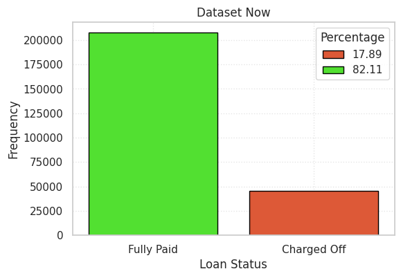
  </a>
</div>
<br />


## Classifying variables:

#### Concepts for Classification of variables according to statistics:

**Quantitative or numerical variables**:

* *Discrete*: only take integer values

* *Continuous*: assumes any value in the range of real numbers

**Qualitative or categorical variables**:

* *Nominals*: when categories do not have a natural order

* *Ordinals*: when categories can be ordered.

```py
  # Categorical Variables
  
  categorical_nominals =  [
     'verification_status', 'emp_title', 'home_ownership', 'purpose', 'title', 'addr_state', 'initial_list_status', 'loan_status', 
  
  ]
  
  categorical_ordinals = [ 
     'grade', 'sub_grade', 'term', 'emp_length', 
  ]
  
  # Numerical Variables
  
  numerical_discrete = [
      'delinq_2yrs', 'earliest_cr_line', 'inq_last_6mths', 'open_acc', 'pub_rec', 'total_acc', 'acc_now_delinq', 'collections_12_mths_ex_med', 'issue_d'
  ]
  
  
  numerical_continuous = [
     'loan_amnt', 'funded_amnt', 'int_rate', 'installment', 'annual_inc', 'dti', 'revol_bal', 'revol_util', 'tot_coll_amt', 'tot_cur_bal', 'total_rev_hi_lim',
  
  ]
```
<br />
<div align="left">
  <a href="https://github.com/OtnielGomes/0_Portfolio-Credit_Risk_Analysis_with_Pytorch">
    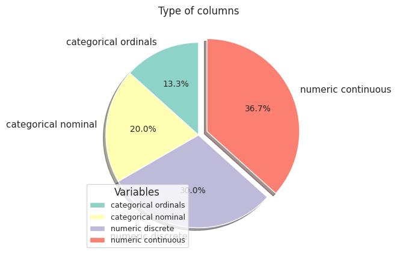
  </a>
</div>
<br />

# 3-Data Preparation

* In this initial step, I will clean the data. We have a lot of invalid data. Initially, I will start by checking the data typing: continuous numeric data will be of type double, and discrete numeric data will be of type integer. This approach will already do a great deal of removing invalid values ​​from the numeric columns. In addition, categorical variables will be checked according to their respective valid categories. 

* Initially, all invalid values ​​will be marked as null, so that at the end of the analysis, I can decide whether to remove them or fill them with some data imputation technique.
### Note:

* The initial data cleaning was performed with the function above.

* **Discrete numeric variables**:

  * These variables were converted to the **'Integer'** type, and the data was filtered in which the values ​​present in the column that were not of the 'Integer' type were removed and filled as null. For example, if a value in a column was 2.3, this value would be considered null, taking into account that discrete variables cannot be partitioned into real numbers.

* **Continuous numeric variables**:

  * They were also converted to their corresponding type. Therefore, the data was filtered in which the values ​​present in the column that were not of the **'Double'** type were removed and filled as null. This approach has already managed to solve the problem of string values ​​that were present in the numeric columns.

* **Categorical/dummy variables**:

  * The data was filtered using the dictionary with valid categories for each variable, and if there were values ​​that were outside these parameters, they were removed and filled in as null.

## EDA 

#### Next steps:

#### Feature selection:

* In this step, I will select features using two approaches:

  * **First**, I will consider the **context** of each of the variables and their importance in the records of this dataset.

  * **Second**, I will evaluate the correlation and relationship of the features with the target variable, which is **loan_status**.

* Based on these points and concepts, I will choose the features that add value to the solution of this problem.

* To calculate the correlation between the columns, I will define a function to index the categorical columns. I will use the correlation to check for numerical variables, while for categorical variables I will use the p-value along with the chi-square (chi2) test.

#### Splitting the training and testing data

* From here on, all the analyses will be based on our training dataset, which will be approximately 80% of the total dataset. I will choose to separate from this point on to avoid leaking **test data**, since this data cannot be influenced by the analysis or data modeling that will be applied to the training data.

* Since this is a credit risk analysis, it is important to consider that the division of the data must take into account the chronological order of the records. This is important to verify the performance of the model with past data (loans that were used for training) in relation to future data (loans that will be requested in the future).

* In other words, this step is important to verify how well the model trained with past data can predict the default of credit applicants at a future point in time.

* Then I will use the **mo_issue_d** variable to classify the records in chronological order, and the division of our data is as follows:

  * **trainset**: Approximately 80% of the records being the oldest and in chronological order.

  * **testset**: Approximately 20% of the records being the newest and in chronological order.

* I will make a small adjustment so that the data is distributed more organically, I will be looking for a margin where we have a time point between the training data and another for the test data. Therefore, with this adjustment we will not have loans with the same number of months in the training and testing data.

### Separating training and test data

```py
  # Sorting the data
sorted_dataset = df
sorted_dataset = sorted_dataset.orderBy('mo_issue_d', ascending = False)

# Creating an id for each record in an orderly manner
sorted_dataset = sorted_dataset.withColumn('index', F.monotonically_increasing_id()) 

sorted_dataset.select('index', 'loan_amnt', 'loan_status', 'mo_issue_d') \
    .limit(10) \
    .display()
```
<br />
<div align="left">
  <a href="https://github.com/OtnielGomes/0_Portfolio-Credit_Risk_Analysis_with_Pytorch">
    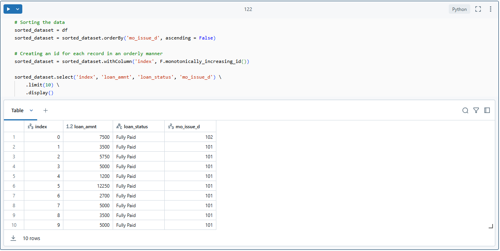
  </a>
</div>
<br />

#### Looking for a margin for data division

```py
# Calculating the limit for division
  
  total_data = sorted_dataset.count()
  
  train_size = int(total_data * 0.8)
  
  # Partitioning the data
  # trainset
  train_m = sorted_dataset.filter(F.col('index') < train_size)
  
  # testset
  test_m = sorted_dataset.filter(F.col('index') >= train_size)
```
#### Train margin

```py
  train_m.select('mo_issue_d').describe().display()
```
<br />
<div align="left">
  <a href="https://github.com/OtnielGomes/0_Portfolio-Credit_Risk_Analysis_with_Pytorch">
    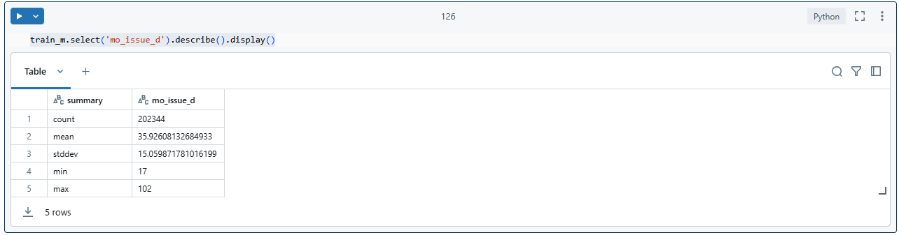
  </a>
</div>
<br />

#### Test margin

```py
  test_m.select('mo_issue_d').describe().display()
```
<br />
<div align="left">
  <a href="https://github.com/OtnielGomes/0_Portfolio-Credit_Risk_Analysis_with_Pytorch">
    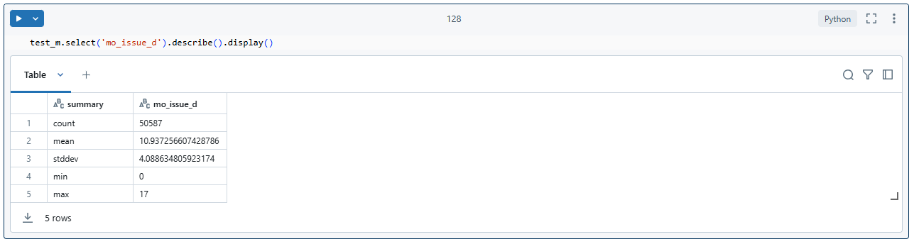
  </a>
</div>
<br />

#### Final parameters for splitting training and test data:

* I will be considering the number of months as 17 with a parameter to separate the training and test data.

##### For the training data, it will be as follows:

* **training_set**: from **18** months to **102** months of loan time in relation to the maximum data collection period.

* There will be records of loans from **1 year and 6 months to loans of 8 years and 6 months**.

##### For the test data, it will be as follows:

* **test_set**: from **0** months to **17** months of loan time in relation to the maximum data collection period

* There will be records of loans from **0 months to loans of 1 year and 5 months**.

### Checking payments status train data and test data:

<br />
<div align="left">
  <a href="https://github.com/OtnielGomes/0_Portfolio-Credit_Risk_Analysis_with_Pytorch">
    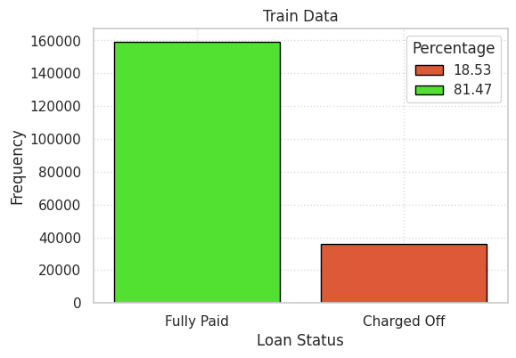
  </a>
</div>
<br />

<br />
<div align="left">
  <a href="https://github.com/OtnielGomes/0_Portfolio-Credit_Risk_Analysis_with_Pytorch">
    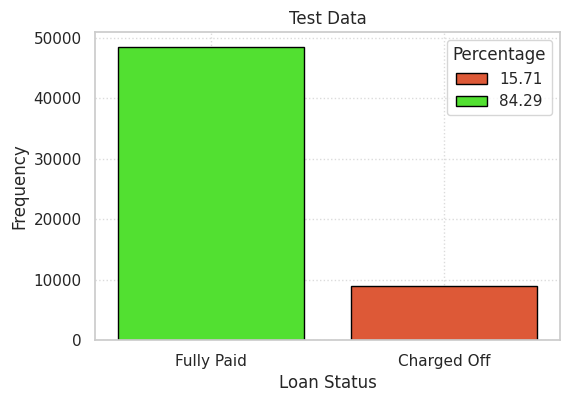
  </a>
</div>
<br />

## Analyzing problems and possible solutions

### With this data, what are the impacts generated by the institution through the loans granted?

<br />
<div align="left">
  <a href="https://github.com/OtnielGomes/0_Portfolio-Credit_Risk_Analysis_with_Pytorch">
    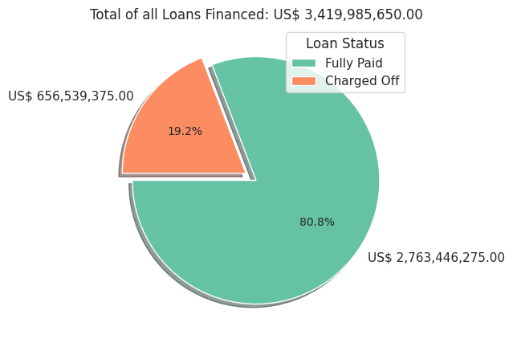
  </a>
</div>
<br />

### Insight:

It can be seen that, in total, loans worth **US$ 3,419,985,650.00** were granted. Of these, **US$ 2,763,446,275.00** was paid in full, while **US$ 656,539,375.00** was lost in part or in full.

### So, what is the consequence of a wrong classification when granting a loan?

If we consider that the loans that were considered lost by Lending Club, if they were declined at the time of application, a **loss** of approximately **US$ 656,539,375.00** could have been avoided.

### What if there was the opposite situation?

If loans that were considered **paid** by Lending Club at the time of application were **unfairly denied**? Because they presented a risk of fraud to the institution. What would be the consequences of this scenario?

<br />
<div align="left">
  <a href="https://github.com/OtnielGomes/0_Portfolio-Credit_Risk_Analysis_with_Pytorch">
    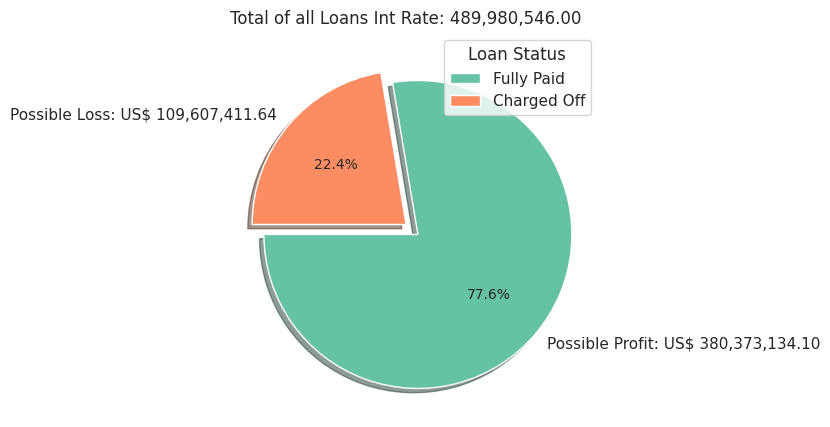
  </a>
</div>
<br />

### Insight:

It is possible to note that loans that were **fully paid** generate a gross interest amount of **US$ 380,373,134.10**. If these loans were denied, this would be a parameter to quantify the **financial loss** that would be caused to the institution.

## Cheking numerical discrete variables

### Note:

* To analyze the discrete variables, I chose to separate them, as some variables, due to the nature of their distribution, are more suitable for visualization through histoplots, while others are more appropriate for countplots.

<br />
<div align="left">
  <a href="https://github.com/OtnielGomes/0_Portfolio-Credit_Risk_Analysis_with_Pytorch">
    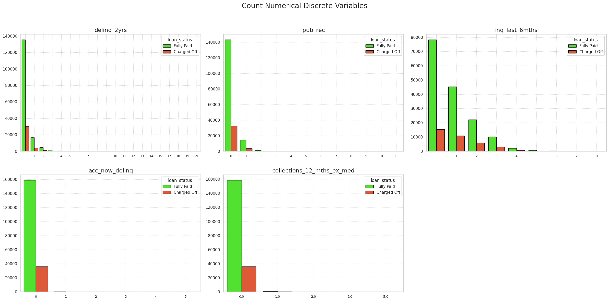
  </a>
</div>
<br />

<br />
<div align="left">
  <a href="https://github.com/OtnielGomes/0_Portfolio-Credit_Risk_Analysis_with_Pytorch">
    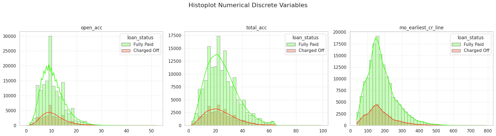
  </a>
</div>
<br />

## Cheking numerical continuos variables

<br />
<div align="left">
  <a href="https://github.com/OtnielGomes/0_Portfolio-Credit_Risk_Analysis_with_Pytorch">
    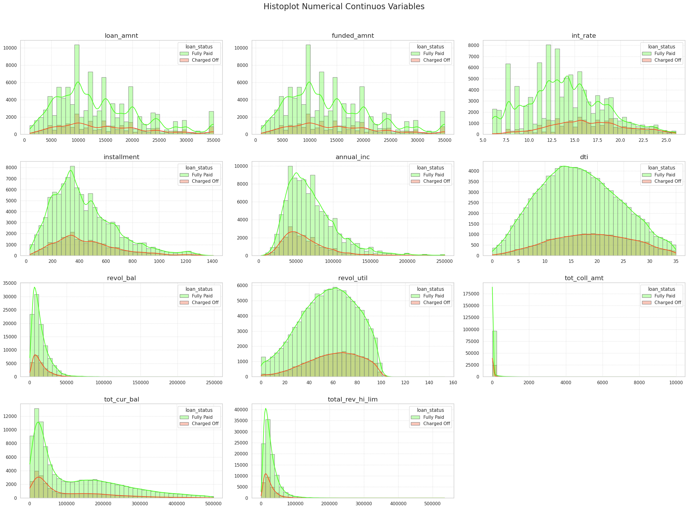
  </a>
</div>
<br />

## Cheking categorical  variables

<br />
<div align="left">
  <a href="https://github.com/OtnielGomes/0_Portfolio-Credit_Risk_Analysis_with_Pytorch">
    
  </a>
</div>
<br />


<p align="right">(<a href="#readme-top">back to top</a>)</p>

## Cheking the locations of the institution's customers

<br />
<div align="left">
  <a href="https://github.com/OtnielGomes/0_Portfolio-Credit_Risk_Analysis_with_Pytorch">
    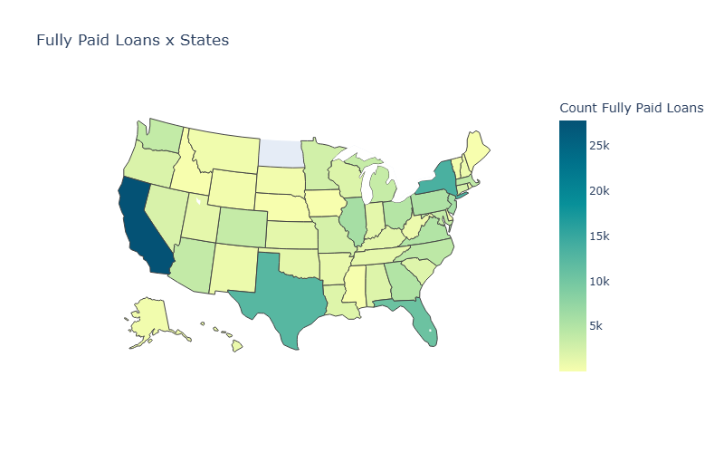
  </a>
</div>
<br />

<br />
<div align="left">
  <a href="https://github.com/OtnielGomes/0_Portfolio-Credit_Risk_Analysis_with_Pytorch">
    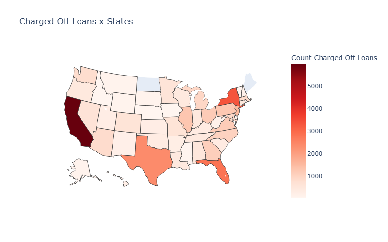
  </a>
</div>
<br />

## Cheking correlations variables

<br />
<div align="left">
  <a href="https://github.com/OtnielGomes/0_Portfolio-Credit_Risk_Analysis_with_Pytorch">
    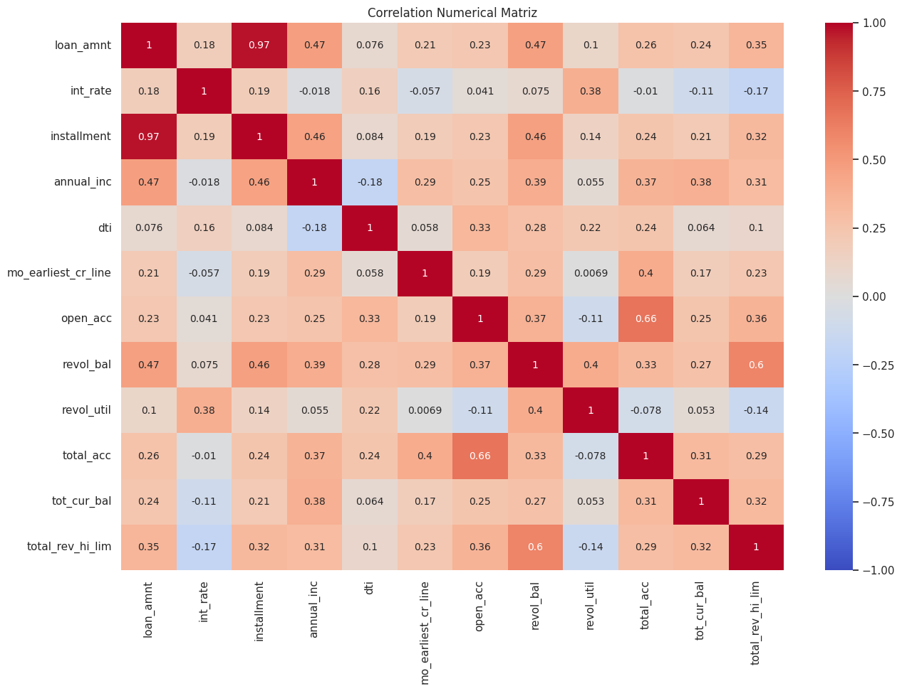
  </a>
</div>
<br />

## Creating new features
* This dataset has some data that are not viable for training a machine learning model, due to the fact that they **have no relationships with the target variable** and, in some cases, due to the **lack of diversity in the numbers**, since most of the values ​​are **zero**.

* We also have some variables with a very large number of null data that, contextually, would be of great value for our analyses, but because they **do not have even 50% of the valid data**, they were not added to the analyses and training. Due to these facts and characteristics present in this dataset, I will choose to explore the data used in the analyses a little more and look for new possibilities and combination of values ​​for the existing variables.

* Therefore, I will explore new possibilities with our data and check the possibility of combining some characteristics to generate new variables, in order to add information to our data.

### Real income
I will be calculating the annual income considering the **DTI** (debt to equity ratio). I will subtract the borrower’s debts and consider only his/her net salary, with debts and liabilities already discounted.

Dti formula:

$$ DTI = {\frac{\text{ Total Debts }}{\text{ Total Income  }}{\text{ x 100 }}} $$

Real Income formula:

$$ Real Income = {\text{Annual Income - }} \frac{\text{( Annual Income x DTI )}}{\text{100}}$$

```py
  data_corr = data_corr.withColumn('real_income', F.round((F.col('annual_inc') - (F.col('annual_inc') * F.col('dti')) / 100), 2))
```

### Ability to pay
I am creating a new column that will interact with the previously created column called **real_income**. This new column will calculate the impact of the monthly installments on the borrower’s monthly income. The calculation will be done as follows: first, I will divide the **real_income by 12**, converting it from annual income to monthly income. Then, I will apply a formula similar to the ‘DTI’ (debt-to-income) calculation to get the impact of the installment on the borrower’s monthly income. I will do this by **dividing the installment amount by the real_income and then multiplying it by 100**. This way, we will get the impact of the installment on the borrower’s monthly income as a percentage.

Ability To Pay formula:

$$ Ability To Pay = \frac{\text{Installment}} {\frac{\text{Real Income }}{\text{12 Months}}}{\text{ x 100}}$$
```py
  data_corr = data_corr.withColumn('ability_to_pay', F.round(((F.col('installment') / (F.col('real_income') / 12)  * 100 )), 2))
```
### Expenses credit rotative vs Income

The **revol_bal** variable: refers to the borrower's revolving balance, which is the amount unpaid at the end of the credit card billing cycle. In other words, it is the amount of debt that remains after the minimum or partial payment of a credit card bill.

Although our **revol_bal** variable has shown a low correlation with our payment status, it provides us with very important information to assess the financial health of our borrowers. With this, it was possible to create a new variable that calculates the borrower's monthly income and then the percentage of monthly income committed to the borrower's current revolving balance.

* I then created a new variable that classifies this as follows:

* **A**: borrowers with 50% or less of their monthly income committed to their current revolving balance.

* **B**: borrowers with more than 50% to 120% of their monthly income committed to their current revolving balance.

* **C**: borrowers with more than 120% to 300% of their monthly income committed to their current revolving balance.

* **D**: borrowers with more than 300% of their monthly income committed to their current revolving balance.

Expenses credit rotative vs Income formula:

$$ Expen Cr Inc = \frac{\text{Revol Bal}} {\frac{\text{Anual Income }}{\text{12 Months}}}{\text{ <= Income Commitment Limit }}$$

```py
  data_corr = data_corr.withColumn('mo_income', F.round(F.col('annual_inc') / 12, 2)) \
    .withColumn('expen_cr_inc', F.when((F.round(F.col('revol_bal') / (F.col('mo_income')), 2) <= 0.5) , 'A').otherwise(None)) \
    .withColumn('expen_cr_inc', F.when((F.col('revol_bal') / (F.col('mo_income')) > 0.5) & 
                                       (F.col('revol_bal') / (F.col('mo_income')) <= 1.2), 'B').otherwise(F.col('expen_cr_inc'))) \
    .withColumn('expen_cr_inc', F.when((F.col('revol_bal') / (F.col('mo_income')) > 1.2) & 
                                       (F.col('revol_bal') / (F.col('mo_income')) <= 3), 'C').otherwise(F.col('expen_cr_inc'))) \
    .withColumn('expen_cr_inc', F.when(F.col('revol_bal') / (F.col('mo_income')) > 3 , 'D').otherwise(F.col('expen_cr_inc')))
```

### Score_cr

The **score_cr** variable is based on the rules of the FICO Score. This score takes into account some information about the borrower's financial health and generates a score.

*Here are the FICO Score scoring rules:*

* **Payment history (35%)**
  * The first thing any lender wants to know is whether you have paid previous credit accounts on time. This helps the lender figure out how much risk they will take on granting you credit. This is the most important factor in a FICO score.

  * *Columns in the dataset*: 'delinq_2yrs', 'pub_rec', 'tot_coll_amt'.

* **Amounts owed (30%)**
  * Having credit accounts and owing money on them does not necessarily mean you are a high-risk borrower with a low FICO score. However, if you’re using too much of your available credit, it could indicate that you’re overextended — and lenders may interpret this to mean that you’re at higher risk of defaulting.

  * *Columns in the dataset*: 'expen_cr_inc', 'revol_util', 'dti'

* **Length of credit history (15%)**
  * In general, having a longer credit history is positive for your FICO Scores, but it’s not necessary for a good credit score. How long ago specific credit accounts were established. How long it’s been since you used certain accounts

  * *Column in the dataset*: 'mo_earliest_cr_line'

* **Credit mix (10%)**
  * FICO Scores will consider your mix of credit cards, retail accounts, installment loans, finance company accounts, and mortgage loans. Don’t worry, you don’t need to have one of each. 

  * *Column in the dataset*: 'total_acc'

* **New credit (10%)**
  * Research shows that opening multiple credit accounts in a short space of time poses a greater risk – especially for people who don't have a long credit history.

  * *Columns in the dataset*: 'open_acc', 'inq_last_6mths'

```py
  # Total points: 1000
  # Payment history 35% of points: 350.0
  # Amounts due 30% of points: 300.0
  # Length of credit history 15% of points: 150.0
  # Credit mix 10% of points: 100.0
  # New credit 10% of points: 100.0

  # Payment history: 350 points divided by 3 features('delinq_2yrs', 'collections_12_mths_ex_med', 'tot_coll_amt') = 166.66.
  weigth_pay_history = (350 / 3)

  # Amounts due: 350 points divided by 3 features('expen_cr_inc', 'revol_util', 'dti') = 100.
  weigth_amnt_due = (300 / 3)
  
  # Length of credit: 150 points only feature('credit_time') = 150.
  weigth_length_cr = 150
  
  # Credit mix: 100 points only feature('total_acc') = 100.
  weigth_cr_mix = 100
  
  # New credit: 100 points divided by 2 features('open_acc', 'inq_last_6mths') = 50.
  weigth_new_cr = (100 / 2)

  data_corr = data_corr.withColumn('score_cr', F.lit(0)) \
      .withColumn('score_cr', F.when(F.col('delinq_2yrs') == 0, 
                                     F.col('score_cr') + (weigth_pay_history)).otherwise(F.col('score_cr'))) \
      .withColumn('score_cr', F.when(F.col('delinq_2yrs') == 1, 
                                     F.col('score_cr') + (weigth_pay_history / 2)).otherwise(F.col('score_cr'))) \
      .withColumn('score_cr', F.when(F.col('pub_rec') == 0, 
                                     F.col('score_cr') + (weigth_pay_history)).otherwise(F.col('score_cr'))) \
      .withColumn('score_cr', F.when(F.col('pub_rec') == 1, 
                                     F.col('score_cr') + (weigth_pay_history / 2)).otherwise(F.col('score_cr'))) \
      .withColumn('score_cr', F.when(F.col('tot_coll_amt') == 0, 
                                     F.col('score_cr') + (weigth_pay_history)).otherwise(F.col('score_cr'))) \
      .withColumn('score_cr', F.when(F.col('tot_coll_amt') == 1, 
                                     F.col('score_cr') + (weigth_pay_history / 2)).otherwise(F.col('score_cr'))) \
      .withColumn('score_cr', F.when(F.col('expen_cr_inc') == 'A', 
                                     F.col('score_cr') + (weigth_amnt_due)).otherwise(F.col('score_cr'))) \
      .withColumn('score_cr', F.when(F.col('expen_cr_inc') == 'B', 
                                     F.col('score_cr') + (weigth_amnt_due / 2)).otherwise(F.col('score_cr'))) \
      .withColumn('score_cr', F.when(F.col('expen_cr_inc') == 'C', 
                                     F.col('score_cr') + (weigth_amnt_due / 3)).otherwise(F.col('score_cr'))) \
      .withColumn('score_cr', F.when(F.col('expen_cr_inc') == 'D', 
                                     F.col('score_cr') + (weigth_amnt_due / 4)).otherwise(F.col('score_cr'))) \
      .withColumn('score_cr', F.when(F.col('dti') <= 10, 
                                     F.col('score_cr') + (weigth_amnt_due)).otherwise(F.col('score_cr'))) \
      .withColumn('score_cr', F.when(((F.col('dti') <= 20) & ( F.col('dti') > 10)), 
                                     F.col('score_cr') + (weigth_amnt_due / 2)).otherwise(F.col('score_cr'))) \
      .withColumn('score_cr', F.when(((F.col('dti') <= 30) & (F.col('dti') > 20)), 
                                     F.col('score_cr') + (weigth_amnt_due / 3)).otherwise(F.col('score_cr'))) \
      .withColumn('score_cr', F.when(F.col('dti') > 30, 
                                     F.col('score_cr') + (weigth_amnt_due / 4)).otherwise(F.col('score_cr'))) \
      .withColumn('score_cr', F.when(F.col('revol_util') <= 30, 
                                     F.col('score_cr') + (weigth_amnt_due)).otherwise(F.col('score_cr'))) \
      .withColumn('score_cr', F.when(((F.col('revol_util') <= 60) & ( F.col('revol_util') > 30)), 
                                     F.col('score_cr') + (weigth_amnt_due / 2)).otherwise(F.col('score_cr'))) \
      .withColumn('score_cr', F.when(((F.col('revol_util') <= 90) & (F.col('revol_util') > 60)), 
                                     F.col('score_cr') + (weigth_amnt_due / 3)).otherwise(F.col('score_cr'))) \
      .withColumn('score_cr', F.when(F.col('revol_util') > 90, 
                                     F.col('score_cr') + (weigth_amnt_due / 4)).otherwise(F.col('score_cr'))) \
      .withColumn('score_cr', F.when(F.col('mo_earliest_cr_line') > 150, 
                                     F.col('score_cr') + (weigth_length_cr)).otherwise(F.col('score_cr'))) \
      .withColumn('score_cr', F.when(F.col('mo_earliest_cr_line') <= 150, 
                                     F.col('score_cr') + (weigth_length_cr / 2)).otherwise(F.col('score_cr'))) \
      .withColumn('score_cr', F.when(F.col('total_acc') > 20, 
                                     F.col('score_cr') + (weigth_cr_mix)).otherwise(F.col('score_cr'))) \
      .withColumn('score_cr', F.when(F.col('total_acc') <= 20, 
                                     F.col('score_cr') + (weigth_cr_mix / 2)).otherwise(F.col('score_cr'))) \
      .withColumn('score_cr', F.when(F.col('open_acc') <= 10, 
                                     F.col('score_cr') + (weigth_new_cr)).otherwise(F.col('score_cr'))) \
      .withColumn('score_cr', F.when(F.col('open_acc') > 10, 
                                     F.col('score_cr') + (weigth_new_cr / 2)).otherwise(F.col('score_cr'))) \
      .withColumn('score_cr', F.when(F.col('inq_last_6mths') == 0, 
                                     F.col('score_cr') + (weigth_new_cr)).otherwise(F.col('score_cr'))) \
      .withColumn('score_cr', F.when(F.col('inq_last_6mths') == 1, 
                                     F.col('score_cr') + (weigth_new_cr / 2)).otherwise(F.col('score_cr'))) \
      .withColumn('score_cr', F.round(F.col('score_cr'), 2))
```

### Viewing the new features

<br />
<div align="left">
  <a href="https://github.com/OtnielGomes/0_Portfolio-Credit_Risk_Analysis_with_Pytorch">
    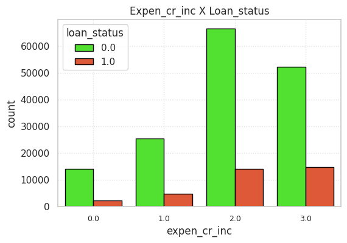
  </a>
</div>
<br />

<br />
<div align="left">
  <a href="https://github.com/OtnielGomes/0_Portfolio-Credit_Risk_Analysis_with_Pytorch">
    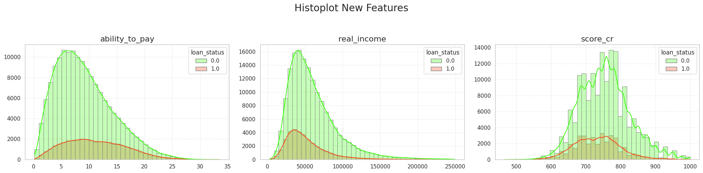
  </a>
</div>
<br />


## Final data processing

* **Irrelevant data**:

  * I will remove from the training and test sets the columns that were excluded according to the above analyses.

* **Null or missing data**:

  * **Numeric data**: The numeric data from the columns:

    * revol_util

    * tot_coll_amt

    * tot_cur_bal

    * total_rev_hi_lim

  * will be imputed using the median, a sensible choice for filling in missing data, especially considering the presence of outliers in the numeric data in this set.

  * **Categorical data**: We have no missing values ​​in our categorical columns.

  * **Note**:

    I chose to impute the null data to preserve the natural distribution of the data in this dataset.

* **New features**:

  * New columns will be created right after the null data is discarded, preventing these new columns from containing null data.

* **Correlated variables**:

  * These columns will be removed from our training data, so that there is no noise caused by correlation in our training since they are correlated with the new features:

    * revolution_bal

    * annual_inc

  * **loan_amnt x installment**:


  * I will choose to remove the **installment** column and keep the **loan_amnt** column, since this column has a stronger relationship with the payment statuses.

# 4-Modeling

* **Categorical Variables**: 
  
  * For ordinal categorical variables, I will use the Ordinal Encoder. For nominal variables, the Target Encoder will be applied, with the aim of not increasing the dimensionality of our data, and also considering that this approach brings us more information for our training data because the variables are encoded according to their distributions in relation to the target variable, which in this case will be the **loan_status**.

* **Numerical Variables**: 
  
  * For numerical data, we will apply the normalization technique using MinMaxScaler. This choice aims to preserve the distribution of the data, considering that our distributions are almost all asymmetric, so opting for MinMaxScaler makes more sense in this context.

  * The decision to use MinMaxScaler also takes into account the fact that our data has a significant amount of outliers. However, these outliers are part of the natural distribution of the institution's data. Therefore, the objective of this choice is to allow the model to learn from this data.

* **Machine learning algorithms that will be used in this project**:

  * The basis of this project is a model with PyTorch, but first, to compare and verify the most suitable models for our data, a model will be created in each of the algorithms below:

  * Random Forest Classifier

  * KNN

  * Logistic Regression

  * XGBoost

  * Next, a network will be created in PyTorch. This network will undergo an initial training, in which we will evaluate the metrics and the results obtained.

* **How will the metrics for the evaluation stage be chosen?**:

  * The metrics that will be considered as a parameter to determine the best model and its effectiveness will be **AUC-ROC** together with **Accuracy**. Since we are dealing with binary classes and we have a minority class, which are the loans classified as unpaid, the accuracy of the model would not be enough to determine whether the model converged adequately with its classifications.

  * Therefore, I will be using the **AUC-ROC** metric as the first criterion as a main parameter to determine the effectiveness of the model. This metric takes into account the correct classification of the positive and negative classes, since in a dataset where we have an imbalance in the classes, it is common and natural to expect that the model has a tendency to classify most of the training and testing data with the majority class. Therefore, we will use this metric as a fundamental parameter for the evaluation and analysis of our models, so that we have a good control over false positives and false negatives, in order to reduce them as much as possible.

  * In the background, I will use the accuracy of the model to consider whether there is good predictability of the model with training, validation and testing data.

* **Hypertune | Finetune**:

  * After this initial training, we will **hypertune** the model, adjusting the hyperparameters and the number of neurons in the hidden layers.

  * Later, we will **finetune**, adjusting the learning level per epoch of the model.

* **Test data**

  * Finally, we will move on to the model evaluation stage, in which we will check its performance on the test data.

## Separating features and labels 

```py
  train_data['loan_status'] = train_data['loan_status'].map({'Fully Paid': 0, 'Charged Off': 1}).astype(int)
  test_data['loan_status'] = test_data['loan_status'].map({'Fully Paid': 0, 'Charged Off': 1}).astype(int)
```

```py
  # Train
  X_train = train_data.drop(columns = ['loan_status']) 
  y_train =  train_data['loan_status'].copy()
  
  # Test
  X_test = test_data.drop(columns = ['loan_status']) 
  y_test =  test_data['loan_status'].copy()
```

## Preprocessing

### Categorical Features
```py
  # Ordinal features
  ordinal_features = [
       'term', 'sub_grade', 'expen_cr_inc'  
  ]
  # Manual adjustment
  ordinal_emp_length = ['emp_length']
  
  # Nominal Features
  
  nominal_features = ['home_ownership', 'purpose', 'initial_list_status', 'tot_coll_amt', 'delinq_2yrs', 'pub_rec', 'inq_last_6mths',]
```

### Numerical Features
```py
  num_features = [
    'loan_amnt', 'int_rate', 'dti', 'open_acc', 'revol_util', 'total_acc','tot_cur_bal', 'total_rev_hi_lim', 'real_income', 'ability_to_pay', 'score_cr',   'mo_earliest_cr_line',
  ]
```

### Preprocessor

```py
  # Categorical ordinal
  categorical_ordinal = Pipeline(
      steps = [
          ('ordinal_encoder', OrdinalEncoder()),
          ('min_max_scaler', MinMaxScaler()),
      ]
  )
  # emp_length
  emp_length_ordinal = Pipeline(
      steps = [
          ('ordinal_encoder', OrdinalEncoder(categories = [['0', '1', '2', '3', '4', '5', '6', '7', '8', '9', '10']])),
          ('min_max_scaler', MinMaxScaler()),
      ]
  )
  
  
  # Categorical Nominal
  categorical_nominal = Pipeline(
      steps = [
          ('target_encoder', TargetEncoder(cols = nominal_features)),
          ('min_max_scaler', MinMaxScaler()),
      ]
  )
  
  
  # Column Transformer
  preprocessor = ColumnTransformer(
      transformers = [
          ('ordinal', categorical_ordinal, ordinal_features),
          ('ord_emp_length', emp_length_ordinal, ordinal_emp_length),
          ('target', categorical_nominal, nominal_features),
          ('numerical_features', MinMaxScaler(), num_features),
      ],
      remainder = 'passthrough'
  )
```
## Training models

### Confusion Matrix models

#### Random Forest Classifier

<br />
<div align="left">
  <a href="https://github.com/OtnielGomes/0_Portfolio-Credit_Risk_Analysis_with_Pytorch">
    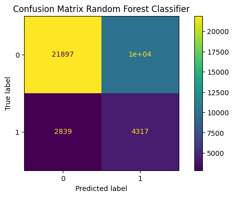
  </a>
</div>
<br />

#### KNN

<br />
<div align="left">
  <a href="https://github.com/OtnielGomes/0_Portfolio-Credit_Risk_Analysis_with_Pytorch">
    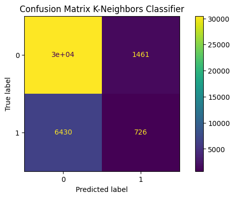
  </a>
</div>
<br />

#### Logistic Regression

<br />
<div align="left">
  <a href="https://github.com/OtnielGomes/0_Portfolio-Credit_Risk_Analysis_with_Pytorch">
    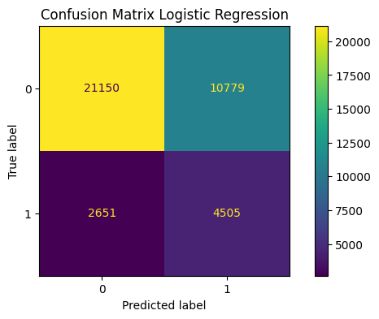
  </a>
</div>
<br />

#### XGBoost 

<br />
<div align="left">
  <a href="https://github.com/OtnielGomes/0_Portfolio-Credit_Risk_Analysis_with_Pytorch">
    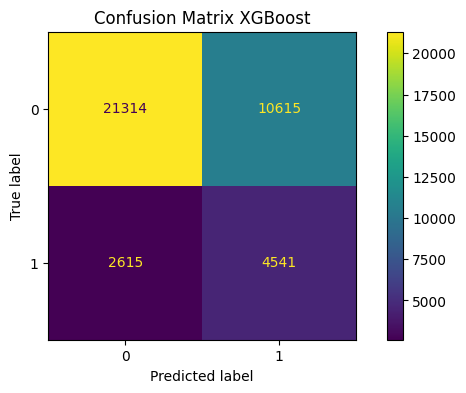
  </a>
</div>
<br />
<br />


### Pytorch
<br />
<div align="center">
  <a href="https://github.com/OtnielGomes/0_Portfolio-Credit_Risk_Analysis_with_Pytorch">
    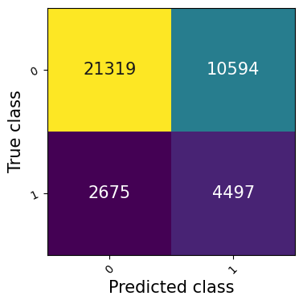
  </a>
</div>
<br />

## Scores Models

<br />
<div align="left">
  <a href="https://github.com/OtnielGomes/0_Portfolio-Credit_Risk_Analysis_with_Pytorch">
    
  </a>
</div>
<br />

#5-Evaluation

### Considerations on initial training:

At this stage of the project, some models were tested to verify the performance of the data in different algorithms.

* I used the following models:

  * Random Forest Classifier - RFC

  * K-Nearest Neighbors - KNN

  * Logistic Regression – LR

  * XGBoost

  * PyTorch

* From the beginning, the project was based on building a model in **PyTorch** for credit risk classifications, but it makes a lot of sense to test different algorithms to compare them and understand the main characteristics of our data.

* The metric that best fits the resolution of our problem will be **ROC-AUC**, because as it is a dataset with minority classes and binary classification, this metric takes into account the true classifications. In datasets with minority classes, it is natural for the models to present a greater number of false positives and false negatives.

* Still talking about the metric that will be used to evaluate the performance of the models, we can also consider the context of the problem to be solved. Since this is a credit risk analysis model, it is important that both classifications, both the **negative classes: 0 - (loans classified as paid)** and the **positive classes: 1 - (loans classified as unpaid)**, are classified using the same criteria, taking into account that an incorrect classification on both sides can reflect a significant loss for the institution. In the background, the **Accuracy** of each model will also be analyzed, aiming to have a satisfactory and adequate forecast for the loans.

* An initial training was carried out on all the models above to compare and analyze the results. In these initial trainings, I considered the imbalance of the classes in the data set and understood that it would be more appropriate to use the resources of each algorithm to deal with this imbalanced data.

##### Random Forest Classifier - RFC: 
  
* The parameter *class_weight='balanced'* was used to balance the imbalance of classes. 

* The model performed well in both **AUC-ROC** and **Accuracy** metrics, both in the *training and validation data*, with a well-balanced confusion matrix.


##### K-Nearest Neighbors - KNN: 
  
* The parameter *weights='distance'* was used to balance the class imbalance. 

* The model performed well in both **AUC-ROC** and **Accuracy** metrics, *but only in the training data*. 

* The performance in the *validation data* did not produce the same result, indicating a slight **Overfitting**. As a result, the *confusion matrix became unbalanced*, with a very good classification for the positive classes, but poor for the negative classes. 

* In our confusion matrix, we can see that we have a very large number of **false negatives**, which is not good for a model, and an *Accuracy of the negative classes close to 11%*, **which indicates that the model is not capable of making predictions in this class**.

##### Logistic Regression: 

* The parameter *class_weight='balanced'* was used to balance the class imbalance. 

* The model performed well in both **AUC-ROC** and **Accuracy metrics**, both in *training and validation data*, with a well-balanced confusion matrix. However, **Accuracy**, although satisfactory, *was slightly lower compared to the other models*.

##### XGBoost: 

* The *scale_pos_weight* parameter was used to balance class imbalance. 

* The model performed well in both **AUC-ROC** and **Accuracy** metrics, both in *training and validation data*, with a well-balanced confusion matrix.

##### PyTorch: 

* I chose a different approach, using the **DataLoader** feature, a tool responsible for organizing the data into training batches. 

* In the *training data*, the **sampler** function was used, which generates a *specific weight for each class according to its distribution*. In other words, minority classes will have higher weights and majority classes, lower weights. Thus, the **DataLoader** will select the data according to the weights, generating a balance in the assembly of batches for training. For example, a batch of size 32 will have 16 negative classes and 16 positive classes. 

* In the *validation data*, the default configuration was used to assemble the batches, with the parameter *shuffle=True*, where the data is shuffled **randomly**, regardless of the classes. This ensures unbiased validation, allowing an assertive and real analysis of the model's performance on the validation data.

* I also considered using **pos_weight** to generate a balance in the minority classes. The pos_weight is a parameter of **BCEWithLogitsLoss** that adjusts the error penalty according to the weight of the minority classes. However, compared to the two methods, using the sampler in DataLoader demonstrated, in the initial training, *better performance and compatibility with the training and validation data*.

* The model performed well in both **AUC-ROC** and **Accuracy metrics**, both in training and validation data, with a well-balanced confusion matrix.

* Of the trained models, I will be choosing PyTorch, as it obtained a satisfactory AUC-ROC and Accuracy score. I believe that, since it is a neural network, it provides us with several tools so that the model can **generalize** all the data in this training set, facilitating predictions of both test data and future data that may be received by the institution.

* I chose to include the **weight decay** (L2 Regularization) and **dropout** parameters to have a more robust network that is more likely to deal well with the *variation of new data and records*.

* The **weight decay** helps prevent very large weight adjustments, regularizing the values ​​directly. *This prevents overfitting and also makes the model have a more stable adjustment with the training data*.

* The **dropout** adds uncertainty to the training, making the model more robust to data variability, as it randomly turns off a portion of the neurons during the training epochs, forcing the network to not depend specifically on just one neuron,*promoting more distributed learning*.

* To better adjust this model, I will be performing **HyperTuning** to adjust the number of neurons in each layer and the other hyperparameters present in this network, aiming to maintain good generalization of the data and good performance of the metrics mentioned above.

## Hypertunning

```print
    Best trial config: {'l1': 2, 'l2': 64, 'l3': 8, 'lr': 0.0006325676320034128, 'batch_size': 256}
    
    Best trial final validation loss: 0.5790479942864063
    Best trial final validation accuracy: 0.7356786727905273
    Best trial final validation auc_roc: 0.7059769034385681
    
    Best trial test set loss: [0.5630040202157155]
    Best trial test set accuracy: [0.7350901961326599]
    Best trial test set auc_roc:[0.7020368576049805]
```

## Fine Tuning

* In this step, all the parameters obtained in **Hypertuning** will be applied. Then, controlled Fine-Tuning will be applied, which allows fine-tuning of the feature layers with a lower learning rate, while adjusting the classification layers more quickly. In this network, the layers were assembled using PyTorch's **'nn.Sequential'**, which allowed us to partition the network into two parts:

* **Features**: These are the layers responsible for capturing the characteristics of the data.

* **Classifier**: Layer responsible for outputting/classifying the data.

## Pytorch with Test data
#### Confusion Matrix

<br />
<div align="center">
  <a href="https://github.com/OtnielGomes/0_Portfolio-Credit_Risk_Analysis_with_Pytorch">
    
  </a>
</div>
<br />

### Considerations on validating the model on test data:

* At this stage of the project, we finally submitted our model to the test data. We can see that our AUC-ROC and Precision scores were satisfactory compared to the training data scores, and the confusion matrix is ​​balanced. The model presented the following scores:

  * **AUC-ROC**: 71.08%
  * **Accuracy**: 66.42%
  * **F1 Score**: 37.41%
  * **Recall**: 63.87%

#### Why were the classifications more balanced between negative and positive classes in the test data compared to the training data?

* Our training and test data were separated in an orderly manner based on the loan start dates. During Exploratory Data Analysis (EDA), we observed that the test data had less null data, which possibly contributed to some variables having greater relevance with the model's target variable, which is **loan_status**. Another factor that directly contributed to this result was the difference in the proportion of defaulted records between the datasets. The training data has approximately **18.50%** of defaulted records, while the test data has approximately **15.70%**.

* This difference in the training and test data, considering the chronological order of the loans, suggests that, over the years, the institution has improved and reduced the number of defaulted loans. Several factors may have positively contributed to this improvement, such as improved data collection during the loan granting process and better classification of borrowers based on their past experiences.

* Therefore, the model had no difficulty in adapting and generalizing the classifications with the test data, since this data, in addition to presenting better quality in terms of cleanliness and quantity of null data, also presented a lower proportion of defaulting customers compared to the training data.

#### Individual classification of each class:

* **Target 0**: Customers who paid their loans: **66.89% Accuracy** >>> **True Positives**: 32428 X **False Positives**: 16047
* **Target 1**: Customers who did not pay their loans: **63.87% Accuracy** >>> **True Negatives**: 5770 X **False Negatives**: 3264

* The model obtained a considerably higher accuracy in loans that were paid, which leads us to conclude that it has good detection for these loans.

#### Conclusion

* Regarding the accuracy of our model, we can conclude that it is satisfactory, considering the limitations of our dataset. We dealt with a considerable amount of null data in some variables that were crucial to the project. Some variables could not be used due to this problem, and they could have contributed positively to our model. Our numerical data has asymmetric distributions and a significant number of outliers, which, as verified in the EDA, are part of the natural distribution of the data in this set.

* In the next and final phase of this project, we will seek a solution to generate a balance in the classification of our model regarding whether or not to pay the requested loan, with the final decision in the organization based on our analysis and results.

# 6-Deployment

* Considering that the model has a prediction **Accuracy of 66.42%** on the test data and the **ACU-ROC of 71.08%**, during the classification process some limits and parameters will be defined using some variables that were fundamental in our data analysis process.

* In addition to these variables helping us and giving us a broader view of our model's classifications, they will also help us give feedback to our potential client in case of approval or disapproval.

* I will use the training data to define these limits so that there is no leakage with the test data.

* To implement our final model, I will first consider the classification of our model and then consider the following variables to validate these classifications:

* **ability_to_pay**: The loan applicant's ability to pay considering his/her monthly salary x the loan installment.

* **dti**: The borrower's debt ratio.

* **score_cr** : The applicant's loan score based on FICO score criteria.

* **sub_grade** : The risk rating of the loan made by Lending Club.

* **expen_cr_inc** : The rating of the applicant's level of revolving credit utilization.

#### So our classifier will be as follows:

* When the model classifies the loans as **fully paid** and the applicant has the following scores and classifications:

  
  * **ability_to_pay**  < 10%

    * OR

  * **dti** < 15%

    * OR

  * **score_cr** > 700

    * OR

  * **expen_cr_inc** == 'A'

    * AND

  * **sub_grade** in ['A1', 'A2', 'A3', 'A4', 'A5', 'B1', 'B2', 'B3', 'B4', 'B5'] # **good_grades**

* This loan will be classified as:

  * **very low risk of default**. 

  * *Therefore it will be automatically approved*

* And if the model classifies the loans as fully paid and the applicant **does not have the scores and classifications above**:

* This loan will be classified as:
   
  * **Low risk of default**. 

   * *Therefore, it will be forwarded for analysis by the manager to be approved or not*

* When the model classifies the loans as **defaulters** and the applicant has the following scores and classifications:

  * **ability_to_pay**  > 10%

    * OR

  * **dti** > 15%

    * OR

  * **score_cr** <= 700

    * OR

  * **expen_cr_inc** == 'B' or 'C' or 'D'

    * AND

  * **sub_grade** in ['E1', 'E2', 'E4', 'E5', 'F1', 'F2', 'F3', 'F4', 'F5', 'G1', 'G2', 'G3', 'G4', 'G5'] # **bad_grades**

* This loan will be classified as:
  
  * **Very high risk of default**. 
  
  * *Therefore, it will be automatically rejected*

* And if the model classifies the loans as as defaulters and the applicant **does not have the scores and classifications above**:

* This loan will be classified as:

  * **Medium risk of default**.   

  * *Therefore, it will be forwarded for analysis by the manager to be approved or not*
 
  <br />
<div align="left">
  <a href="https://github.com/OtnielGomes/0_Portfolio-Credit_Risk_Analysis_with_Pytorch">
    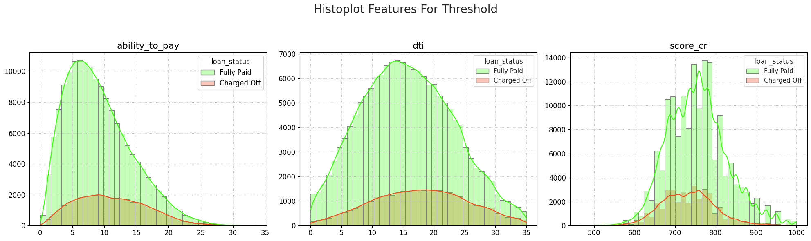
  </a>
</div>
<br />

<br />
<div align="left">
  <a href="https://github.com/OtnielGomes/0_Portfolio-Credit_Risk_Analysis_with_Pytorch">
    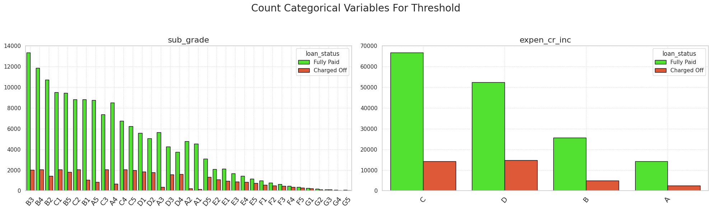
  </a>
</div>
<br />

### Good Grades

<br />
<div align="left">
  <a href="https://github.com/OtnielGomes/0_Portfolio-Credit_Risk_Analysis_with_Pytorch">
    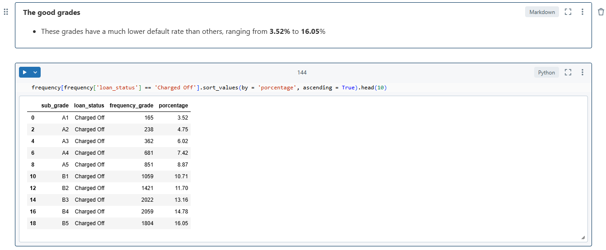
  </a>
</div>
<br />

### Bad Grades

<br />
<div align="left">
  <a href="https://github.com/OtnielGomes/0_Portfolio-Credit_Risk_Analysis_with_Pytorch">
    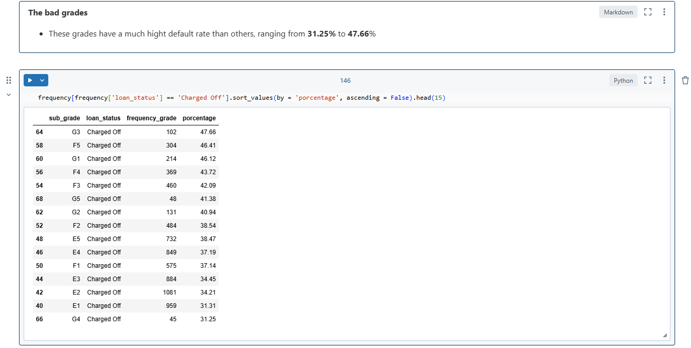
  </a>
</div>
<br />

# Final Classifier

```py

  def loan_checker(loan_for_class, device = 'cpu'):
      
      # Data preprocessing
      data_preprocessed = preprocessor_loaded.transform(loan_for_class)
      
      # Loading Network Trained
      net = model_loaded.to(device)
  
      # Net to eval
      net.eval()
      # Loading Dataset
      X = torch.from_numpy(data_preprocessed.astype(np.float32))
      X = X.to(device)
      pred = net(X)
      pred = torch.sigmoid(pred).cpu()
      
      probabilities  = pred.item()
  
      # Convert probabilities to binary values ​​(0 or 1) using a threshold
      thershold = 0.5
      binary_pred = (pred >= thershold).int().item()
      
      print(f'\nThis loan has a: {round((probabilities * 100), 2)}% chance of defaulting')
    
      model_prediction = binary_pred
      # expen_cr_inc
      bad_expen = ['D']
      good_expen = ['A']
      expen_cr_inc = loan_for_class['expen_cr_inc'].item()
      # sub_grade
      bad_grades = ['E1', 'E2', 'E4', 'E5', 'F1', 'F2', 'F3', 'F4', 'F5', 'G1', 'G2', 'G3', 'G4', 'G5',]
      good_grades = ['A1', 'A2', 'A3', 'A4', 'A5', 'B1', 'B2', 'B3', 'B4', 'B5',]
      sub_grade = loan_for_class['sub_grade'].item()
  
      # dti
      dti = loan_for_class['dti'].item()
      # score_cr
      score_cr = loan_for_class['score_cr'].item()
      # ability_to_pay
      ability_to_pay = loan_for_class['ability_to_pay'].item()
  
      if model_prediction == 1:
  
          if (ability_to_pay > 10 or score_cr < 700 or dti > 15 or expen_cr_inc in bad_expen) and (sub_grade in bad_grades):
              print(f'Loan denied! ---  High risk of default loan')
              print(f'\nThis loan has been considered high risk because some of the scores below do not meet the criteria required for loan approval.')
              print(f"\nexpen_cr_inc: {expen_cr_inc} >>>> {'Not OK' if expen_cr_inc in bad_expen else 'OK'}")
              print(f"score_cr: {score_cr} >>>> {'Not OK' if score_cr < 700 else 'OK'}")
              print(f"ability_to_pay: {ability_to_pay} >>>> {'Not OK' if ability_to_pay > 10 else 'OK'}")
              print(f"dti: {dti} >>>> {'Not OK' if dti > 15 else 'OK'}")
              print(f"\n### sub_grade ###: {sub_grade} >>>> {'Not OK' if sub_grade in bad_grades else 'OK'}")
          else:
              print(f'Approval subject to manager analysis! --- Medium risk loan of default')
              print(f'\nThis loan has been considered medium risk because some of the scores below meet the criteria required for loan approval.')
              print(f"\nexpen_cr_inc: {expen_cr_inc} >>>> {'Not OK' if expen_cr_inc in bad_expen else 'OK'}")
              print(f"score_cr: {score_cr} >>>> {'Not OK' if score_cr < 700 else 'OK'}")
              print(f"ability_to_pay: {ability_to_pay} >>>> {'Not OK' if ability_to_pay > 10 else 'OK'}")
              print(f"dti: {dti} >>>> {'Not OK' if dti > 15 else 'OK'}")
              print(f"\n### sub_grade ###: {sub_grade} >>>> {'Not OK' if sub_grade in bad_grades else 'OK'}")
      
  
      if model_prediction == 0:
  
          if (ability_to_pay < 10 or score_cr >= 700 or dti < 15 or expen_cr_inc in (good_expen)) and (sub_grade in(good_grades)):
              print(f'Loan approved! ---  Very low default risk loan')
              print(f'\nThis loan has been deemed very low risk because some of the scores below meet the criteria required for loan approval.')
              print(f"\nexpen_cr_inc: {expen_cr_inc} >>>> {'OK' if expen_cr_inc in good_expen else 'Not OK'}")
              print(f"score_cr: {score_cr} >>>> {'OK' if score_cr >= 700 else 'Not OK'}")
              print(f"ability_to_pay: {ability_to_pay} >>>> {'OK' if ability_to_pay <= 10 else 'Not OK'}")
              print(f"dti: {dti} >>>> {'OK' if dti <= 15 else 'Not OK'}")
              print(f"\n### sub_grade ###: {sub_grade} >>>> {'OK' if sub_grade in good_grades else 'Not OK'}")
          else:
              print(f'Approval subject to manager analysis! --- Low risk of default loan')
              print(f'\nThis loan has been deemed low risk because some of the scores below do not meet the criteria required for loan approval.')
              print(f"\nexpen_cr_inc: {expen_cr_inc} >>>> {'OK' if expen_cr_inc in good_expen else 'Not OK'}")
              print(f"score_cr: {score_cr} >>>> {'OK' if score_cr >= 700 else 'Not OK'}")
              print(f"ability_to_pay: {ability_to_pay} >>>> {'OK' if ability_to_pay <= 10 else 'Not OK'}")
              print(f"dti: {dti} >>>> {'OK' if dti <= 15 else 'Not OK'}")
              print(f"\n### sub_grade ###: {sub_grade} >>>> {'OK' if sub_grade in good_grades else 'Not OK'}")
  
```

### Exemple output

```print
    This loan has a: 46.75% chance of defaulting
    Loan approved! ---  Very low default risk loan
    
    This loan has been deemed very low risk because some of the scores below meet the criteria required for loan approval.
    
    expen_cr_inc: D >>>> Not OK
    score_cr: 716.67 >>>> OK
    ability_to_pay: 11.26 >>>> Not OK
    dti: 27.65 >>>> Not OK
    
    ### sub_grade ###: B2 >>>> OK
```


<!-- ROADMAP -->
## Roadmap

- [Notebook-1-EDA](https://github.com/OtnielGomes/0_Portfolio-Credit_Risk_Analysis_with_Pytorch/blob/main/1_Notebooks/0_EDA.ipynb)
- [Notebook-2-Modeling](https://github.com/OtnielGomes/0_Portfolio-Credit_Risk_Analysis_with_Pytorch/blob/main/1_Notebooks/1_Modeling.ipynb)


See the [open issues](https://github.com/OtnielGomes/0_Portfolio-Credit_Risk_Analysis_with_Pytorch/issues) for a full list of proposed features (and known issues).

<p align="right">(<a href="#readme-top">back to top</a>)</p>


<!-- CONTRIBUTING -->
## Contributing

Contributions are what make the open source community such an amazing place to learn, inspire, and create. Any contributions you make are **greatly appreciated**.

If you have a suggestion that would make this better, please fork the repo and create a pull request. You can also simply open an issue with the tag "enhancement".
Don't forget to give the project a star! Thanks again!

1. Fork the Project
2. Create your Feature Branch (`git checkout -b feature/AmazingFeature`)
3. Commit your Changes (`git commit -m 'Add some AmazingFeature'`)
4. Push to the Branch (`git push origin feature/AmazingFeature`)
5. Open a Pull Request

<p align="right">(<a href="#readme-top">back to top</a>)</p>

### Top contributors:

<a href="https://github.com/OtnielGomes/0_Portfolio-Credit_Risk_Analysis_with_Pytorch/graphs/contributors">
  
</a>


<!-- LICENSE -->
## License

Distributed under the MIT License. See [`LICENSE.txt`](https://github.com/OtnielGomes/0_Portfolio-Credit_Risk_Analysis_with_Pytorch/blob/main/LICENSE) for more information.

<p align="right">(<a href="#readme-top">back to top</a>)</p>


<!-- CONTACT -->
## Contact

Otniel Gomes - [linkedin.com/in/otnielgomes](https://www.linkedin.com/in/otnielgomes/) - otniel.g.andrade@gmail.com

Project Link: [https://github.com/OtnielGomes/0_Portfolio-Credit_Risk_Analysis_with_Pytorch](https://github.com/OtnielGomes/0_Portfolio-Credit_Risk_Analysis_with_Pytorch)

<p align="right">(<a href="#readme-top">back to top</a>)</p>


<!-- MARKDOWN LINKS & IMAGES -->
<!-- https://www.markdownguide.org/basic-syntax/#reference-style-links -->

[author-shield]: https://img.shields.io/badge/author-OtnielGomes-red.svg
[author-url]: https://github.com/OtnielGomes

[contributors-shield]: https://img.shields.io/github/contributors/OtnielGomes/0_Portfolio-Credit_Risk_Analysis_with_Pytorch.svg?style=for-the-badge
[contributors-url]: https://github.com/OtnielGomes/0_Portfolio-Credit_Risk_Analysis_with_Pytorch/graphs/contributors

[forks-shield]: https://img.shields.io/github/forks/OtnielGomes/0_Portfolio-Credit_Risk_Analysis_with_Pytorch.svg?style=for-the-badge
[forks-url]: https://github.com/OtnielGomes/0_Portfolio-Credit_Risk_Analysis_with_Pytorch/network/members

[stars-shield]: https://img.shields.io/github/stars/OtnielGomes/0_Portfolio-Credit_Risk_Analysis_with_Pytorch.svg?style=for-the-badge
[stars-url]: https://github.com/OtnielGomes/0_Portfolio-Credit_Risk_Analysis_with_Pytorch/stargazers

[issues-shield]: https://img.shields.io/github/issues/OtnielGomes/0_Portfolio-Credit_Risk_Analysis_with_Pytorch.svg?style=for-the-badge
[issues-url]: https://github.com/OtnielGomes/0_Portfolio-Credit_Risk_Analysis_with_Pytorch/issues

[license-shield]: https://img.shields.io/github/license/OtnielGomes/0_Portfolio-Credit_Risk_Analysis_with_Pytorch.svg?style=for-the-badge
[license-url]: https://github.com/OtnielGomes/0_Portfolio-Credit_Risk_Analysis_with_Pytorch/blob/master/LICENSE.txt

[linkedin-shield]: https://img.shields.io/badge/-LinkedIn-black.svg?style=for-the-badge&logo=linkedin&colorB=555
[linkedin-url]: https://linkedin.com/in/otnielgomes

[Azure Databricks]: https://img.shields.io/badge/Databricks-FF3621?style=for-the-badge&logo=Databricks&logoColor=white
[Azure Databricks-url]:  https://azure.microsoft.com/en-us/pricing/purchase-options/azure-account?icid=databricks

[PyTorch]: https://img.shields.io/badge/PyTorch-%23EE4C2C.svg?style=for-the-badge&logo=PyTorch&logoColor=white
[PyTorch-url]: https://pytorch.org

[scikit-learn]: https://img.shields.io/badge/scikit--learn-%23F7931E.svg?style=for-the-badge&logo=scikit-learn&logoColor=white
[scikit-learn-url]: https://scikit-learn.org/stable/

[Apache Spark]: https://img.shields.io/badge/Apache%20Spark-FDEE21?style=flat-square&logo=apachespark&logoColor=black
[Apache Spark-url]: https://spark.apache.org/

[Pandas]: https://img.shields.io/badge/pandas-%23150458.svg?style=for-the-badge&logo=pandas&logoColor=white
[Pandas-url]: https://pandas.pydata.org/

[Ray Tune]: https://img.shields.io/badge/Ray-028CF0.svg?style=for-the-badge&logo=Ray&logoColor=white
[Ray Tune-url]: https://docs.ray.io/en/latest/tune/index.html

[Matplotlib]: https://img.shields.io/badge/Matplotlib-%23ffffff.svg?style=for-the-badge&logo=Matplotlib&logoColor=black
[Matplotlib-url]: https://matplotlib.org/

[Plotly]: https://img.shields.io/badge/Plotly-%233F4F75.svg?style=for-the-badge&logo=plotly&logoColor=white
[Plotly-url]: https://plotly.com/graphing-libraries/

[NumPy]: https://img.shields.io/badge/numpy-%23013243.svg?style=for-the-badge&logo=numpy&logoColor=white
[NumPy-url]: https://numpy.org/

[Python]: https://img.shields.io/badge/python-3670A0?style=for-the-badge&logo=python&logoColor=ffdd54
[Python-url]: https://www.python.org/

[Azure Databricks CM]: https://img.shields.io/badge/Databricks-FF3621?style=for-the-badge&logo=Databricks&logoColor=white
[Azure Databricks CM-url]: https://community.cloud.databricks.com/
