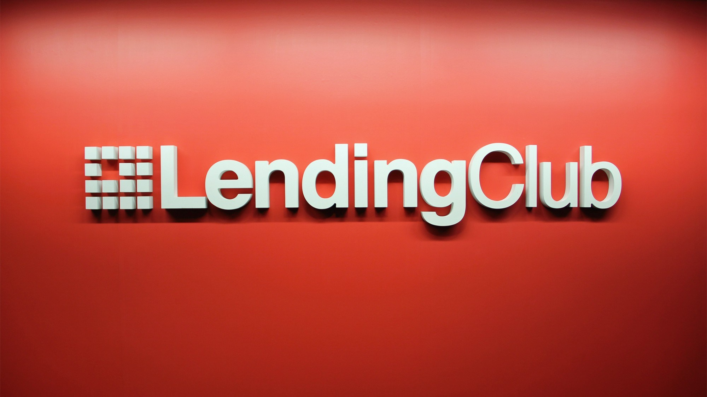

<a id="readme-top"></a>

<!-- PROJECT SHIELDS -->
<!--
*** I'm using markdown "reference style" links for readability.
*** Reference links are enclosed in brackets [ ] instead of parentheses ( ).
*** See the bottom of this document for the declaration of the reference variables
*** for contributors-url, forks-url, etc. This is an optional, concise syntax you may use.
*** https://www.markdownguide.org/basic-syntax/#reference-style-links
-->
[![author][author-shield]][author-url]
# Welcome to my data science portifolio!
<br />

[![Contributors][contributors-shield]][contributors-url]
[![Forks][forks-shield]][forks-url]
[![Stargazers][stars-shield]][stars-url]
[![Issues][issues-shield]][issues-url]
[![MIT License][license-shield]][license-url]
[![LinkedIn][linkedin-shield]][linkedin-url]


<!-- PROJECT LOGO -->
<br />
<div align="center">
  <a href="https://github.com/OtnielGomes/Data_Science_Portfolio">
    
  </a>

<h1 align="center"> Data Science Portifolio </h1>
  <p align="center">
    <br />
  </p>
</div>

Hello, I am a Data Science student, currently in the 2nd year of my degree, and I am looking for knowledge and opportunities in the area of ​​data and technology.

I have been delving deeper and seeking knowledge in Neural Networks, Deep Learning, Data Processing and Big Data Concepts.

Technologies and tools that I have been using in my learning and in my day-to-day life:

**Python, R, Pytorch, Scikit-learn, Pandas, PySpark, Databricks, Azure, SQL, PostgreSQL, Power BI.**

<!-- TABLE OF CONTENTS -->
<details>
  <summary>Table of Contents</summary>
  <ol>
    <li>
      <a href="#about-the-project">About The Project</a>
      <ul>
        <li><a href="#built-with">Built With</a></li>
      </ul>
    </li>
    <li>
      <a href="#getting-started">Getting Started</a>
      <ul>
        <li><a href="#prerequisites">Prerequisites</a></li>
        <li><a href="#installation-of-librarys">Installation of librarys</a></li>
      </ul>
    </li>
    <li><a href="#the-project">The Project</a></li>
    <li><a href="#roadmap">Roadmap</a></li>
    <li><a href="#contributing">Contributing</a></li>
    <li><a href="#license">License</a></li>
    <li><a href="#contact">Contact</a></li>
  </ol>
</details>


<!-- THE PROJECTS -->
<br />

## Projects

<br />

## Classification  - Credit risk classification
<div align="center">
  <a href="https://github.com/OtnielGomes/Data_Science_Portfolio">
    
  </a>
</div>

# Description:

* This project will be built and implemented using the **Azure Databricks** environment, where classifiers will be built with neural network/machine learning models that will seek to predict whether a loan will be paid or not. The basis of the project will be a PyTorch model that will classify the requested loans. In the final model, a classifier will be created that will use the selected model together with some variables and information from the loan applicant to make the final classification, where the loans will be classified into 4 stages of default risk. According to the defined parameters, the classifier will decide whether the loan should be approved or rejected immediately, or if there is the possibility of a reassessment by the institution's stakeholders.

* In this project, I will work with a dataset taken from Kaggle, where I will perform a credit risk analysis. The data provided comes from LendingClub, a financial services company based in San Francisco, California. LendingClub was the first peer-to-peer lending platform to register its offerings as securities with the Securities and Exchange Commission (SEC) and to offer loan trading on a secondary market. The company offers personal loans of up to $40,000, with terms ranging from 24 to 60 months, and operates entirely online, with no physical branches.

* What is the objective of this project?

  * A machine learning model will be created that seeks to make predictions that during the loan application will indicate whether the borrower will be a good payer or not.

  * The main objective is to create analyses that use only the information collected at the time of the loan application. The model focuses on preventing the release of loans to potentially defaulting borrowers, using only the variables available at the time of the request.

  * I will seek to generate several insights so that we have information about the institution's objective, which is to reduce unpaid loans and potential losses in relation to recent years.

* **Final solution**:

    We can make the following considerations regarding loan classifications:

* **Very low risk:** 

  * These are loans classified as paid. The selected indicators are in accordance with the rules of our classifier, which allows us to offer better interest rates to this borrower and possibly increase the requested loan amount.

  * We have an accuracy of **66.89%** for this class of the model. We can consider the rules determined using the variable **'sub_grade'** as the main parameter in the classifier rules. **'good_grades'** have a probability of default that varies from **3.52% to 16.05%**. Therefore, the chances of loans classified under these terms becoming defaulted are very low.

* **Low risk:** 

  * These are loans classified as paid. However, the selected indicators are not in accordance with the rules of our classifier. Therefore, we must consider the borrower's scores and classifications to verify the possibility of approval. In case of approval or not, we have the indicators to justify to our clients the reason for the decision. In cases of approval, we can reduce the amount requested to prevent possible fraud. In case of denial, we can present the indicators that the potential client needs to improve in order to have their loan approved in the future.

  * We have an accuracy of **66.89%** for this class of the model. We can consider the rules determined using the variable **'sub_grade'** as the main parameter in the classifier rules. Since these loans are outside the **goods_grades** we can understand that these loans that received this classification need a more careful analysis considering the other indicators.

* **Medium risk:** 

  * These are loans classified as defaulted. However, the selected indicators are in accordance with the rules of our classifier. Therefore, we must consider the borrower's scores and classifications to verify the possibility of approval. Whether approved or not, we have the indicators to justify the decision to our clients. In cases of approval, we can reduce the amount requested to prevent possible fraud. In cases of denial, we can present the indicators that the potential client needs to improve in order to have their loan approved in the future.

  * We have an accuracy of **63.87%** for this class of the model. We can consider the rules determined using the variable **'sub_grade'** as the main parameter in the classifier rules. Since these loans are outside the **bad_grades** we can understand that these loans that received this classification need a more careful analysis considering the other indicators.

* **Very high risk:** 

  * These are loans classified as defaulted, and the indicators indicate that they will probably not be paid. Therefore, these loans will be denied, and we will use our indicators to justify the reasons for non-approval.

  * We have an accuracy of **63.87%** for this class of the model. We can consider the rules determined using the **'sub_grade'** variable as the main parameter in the classifier rules. **'bad_grades'** have a default probability ranging from **31.25% to 47.66%**. Therefore, the chances of loans classified under these terms becoming defaulted are very high.

### Built With
* [![Databricks][Azure Databricks]][Azure Databricks-url]
* [![Language Python][Python]][Python-url]
* [![Apache][Apache Spark]][Apache Spark-url]
* [![PD][Pandas]][Pandas-url]
* [![NP][NumPy]][NumPy-url]
* [![Matplot][Matplotlib]][Matplotlib-url]
* [![Ploty Lib][Plotly]][Plotly-url]
* [![Torch][PyTorch]][PyTorch-url]
* [![Sklearn][scikit-learn]][scikit-learn-url]
* [![Ray][Ray Tune]][Ray Tune-url]

## Scores Models

<br />
<div align="left">
  <a href="https://github.com/OtnielGomes/Data_Science_Portfolio">
    
  </a>
</div>
<br />

## Pytorch with Test data
#### Confusion Matrix

<br />
<div align="left">
  <a href="https://github.com/OtnielGomes/Data_Science_Portfolio">
    
  </a>
</div>
<br />

## Considerations on validating the model on test data:

* At this stage of the project, we finally submitted our model to the test data. We can see that our AUC-ROC and Precision scores were satisfactory compared to the training data scores, and the confusion matrix is ​​balanced. The model presented the following scores:

  * **AUC-ROC**: 71.08%
  * **Accuracy**: 66.42%
  * **F1 Score**: 37.41%
  * **Recall**: 63.87%


## Final Classifier
```

### Exemple output

```print
    This loan has a: 46.75% chance of defaulting
    Loan approved! ---  Very low default risk loan
    
    This loan has been deemed very low risk because some of the scores below meet the criteria required for loan approval.
    
    expen_cr_inc: D >>>> Not OK
    score_cr: 716.67 >>>> OK
    ability_to_pay: 11.26 >>>> Not OK
    dti: 27.65 >>>> Not OK
    
    ### sub_grade ###: B2 >>>> OK
```
<br />

## Churn Prediction  - Credit Card Churn Prediction

### Under constrution ...

<div align="center">
  <a href="https://github.com/OtnielGomes/Data_Science_Portfolio">
    
  </a>
</div>


- [Notebook-1-EDA](https://github.com/OtnielGomes/0_Portfolio-Credit_Risk_Analysis_with_Pytorch/blob/main/1_Notebooks/0_EDA.ipynb)
- [Notebook-2-Modeling](https://github.com/OtnielGomes/0_Portfolio-Credit_Risk_Analysis_with_Pytorch/blob/main/1_Notebooks/1_Modeling.ipynb)


See the [open issues](https://github.com/OtnielGomes/Data_Science_Portfolio/issues) for a full list of proposed features (and known issues).

<p align="right">(<a href="#readme-top">back to top</a>)</p>


<!-- CONTRIBUTING -->
## Contributing

Contributions are what make the open source community such an amazing place to learn, inspire, and create. Any contributions you make are **greatly appreciated**.

If you have a suggestion that would make this better, please fork the repo and create a pull request. You can also simply open an issue with the tag "enhancement".
Don't forget to give the project a star! Thanks again!

1. Fork the Project
2. Create your Feature Branch (`git checkout -b feature/AmazingFeature`)
3. Commit your Changes (`git commit -m 'Add some AmazingFeature'`)
4. Push to the Branch (`git push origin feature/AmazingFeature`)
5. Open a Pull Request

<p align="right">(<a href="#readme-top">back to top</a>)</p>

### Top contributors:

<a href="https://github.com/OtnielGomes/Data_Science_Portfolio/graphs/contributors">
  
</a>


<!-- LICENSE -->
## License

Distributed under the MIT License. See [`LICENSE.txt`](https://github.com/OtnielGomes/Data_Science_Portfolio/blob/main/LICENSE) for more information.

<p align="right">(<a href="#readme-top">back to top</a>)</p>


<!-- CONTACT -->
## Contact

Otniel Gomes - [linkedin.com/in/otnielgomes](https://www.linkedin.com/in/otnielgomes/) - otniel.g.andrade@gmail.com

Project Link: [https://github.com/OtnielGomes/Data_Science_Portfolio](https://github.com/OtnielGomes/Data_Science_Portfolio)

<p align="right">(<a href="#readme-top">back to top</a>)</p>


<!-- MARKDOWN LINKS & IMAGES -->
<!-- https://www.markdownguide.org/basic-syntax/#reference-style-links -->

[author-shield]: https://img.shields.io/badge/author-OtnielGomes-red.svg
[author-url]: https://github.com/OtnielGomes

[contributors-shield]: https://img.shields.io/github/contributors/OtnielGomes/0_Portfolio-Credit_Risk_Analysis_with_Pytorch.svg?style=for-the-badge
[contributors-url]: https://github.com/OtnielGomes/0_Portfolio-Credit_Risk_Analysis_with_Pytorch/graphs/contributors

[forks-shield]: https://img.shields.io/github/forks/OtnielGomes/0_Portfolio-Credit_Risk_Analysis_with_Pytorch.svg?style=for-the-badge
[forks-url]: https://github.com/OtnielGomes/0_Portfolio-Credit_Risk_Analysis_with_Pytorch/network/members

[stars-shield]: https://img.shields.io/github/stars/OtnielGomes/0_Portfolio-Credit_Risk_Analysis_with_Pytorch.svg?style=for-the-badge
[stars-url]: https://github.com/OtnielGomes/0_Portfolio-Credit_Risk_Analysis_with_Pytorch/stargazers

[issues-shield]: https://img.shields.io/github/issues/OtnielGomes/0_Portfolio-Credit_Risk_Analysis_with_Pytorch.svg?style=for-the-badge
[issues-url]: https://github.com/OtnielGomes/0_Portfolio-Credit_Risk_Analysis_with_Pytorch/issues

[license-shield]: https://img.shields.io/github/license/OtnielGomes/0_Portfolio-Credit_Risk_Analysis_with_Pytorch.svg?style=for-the-badge
[license-url]: https://github.com/OtnielGomes/0_Portfolio-Credit_Risk_Analysis_with_Pytorch/blob/master/LICENSE.txt

[linkedin-shield]: https://img.shields.io/badge/-LinkedIn-black.svg?style=for-the-badge&logo=linkedin&colorB=555
[linkedin-url]: https://linkedin.com/in/otnielgomes

[Azure Databricks]: https://img.shields.io/badge/Databricks-FF3621?style=for-the-badge&logo=Databricks&logoColor=white
[Azure Databricks-url]:  https://azure.microsoft.com/en-us/pricing/purchase-options/azure-account?icid=databricks

[PyTorch]: https://img.shields.io/badge/PyTorch-%23EE4C2C.svg?style=for-the-badge&logo=PyTorch&logoColor=white
[PyTorch-url]: https://pytorch.org

[scikit-learn]: https://img.shields.io/badge/scikit--learn-%23F7931E.svg?style=for-the-badge&logo=scikit-learn&logoColor=white
[scikit-learn-url]: https://scikit-learn.org/stable/

[Apache Spark]: https://img.shields.io/badge/Apache%20Spark-FDEE21?style=flat-square&logo=apachespark&logoColor=black
[Apache Spark-url]: https://spark.apache.org/

[Pandas]: https://img.shields.io/badge/pandas-%23150458.svg?style=for-the-badge&logo=pandas&logoColor=white
[Pandas-url]: https://pandas.pydata.org/

[Ray Tune]: https://img.shields.io/badge/Ray-028CF0.svg?style=for-the-badge&logo=Ray&logoColor=white
[Ray Tune-url]: https://docs.ray.io/en/latest/tune/index.html

[Matplotlib]: https://img.shields.io/badge/Matplotlib-%23ffffff.svg?style=for-the-badge&logo=Matplotlib&logoColor=black
[Matplotlib-url]: https://matplotlib.org/

[Plotly]: https://img.shields.io/badge/Plotly-%233F4F75.svg?style=for-the-badge&logo=plotly&logoColor=white
[Plotly-url]: https://plotly.com/graphing-libraries/

[NumPy]: https://img.shields.io/badge/numpy-%23013243.svg?style=for-the-badge&logo=numpy&logoColor=white
[NumPy-url]: https://numpy.org/

[Python]: https://img.shields.io/badge/python-3670A0?style=for-the-badge&logo=python&logoColor=ffdd54
[Python-url]: https://www.python.org/

[Azure Databricks CM]: https://img.shields.io/badge/Databricks-FF3621?style=for-the-badge&logo=Databricks&logoColor=white
[Azure Databricks CM-url]: https://community.cloud.databricks.com/
