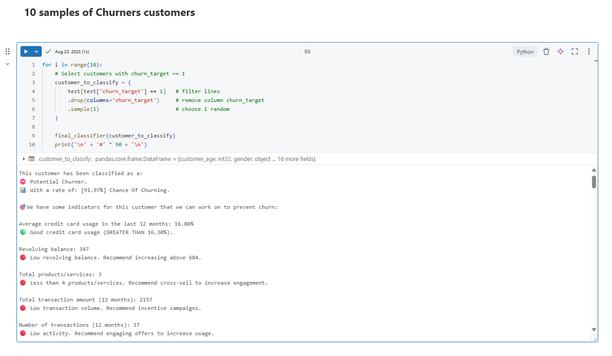

<a id="readme-top"></a>

<!-- PROJECT SHIELDS -->

[![author][author-shield]][author-url]
# Data Science Portifolio

[![Contributors][contributors-shield]][contributors-url]
[![Forks][forks-shield]][forks-url]
[![Stargazers][stars-shield]][stars-url]
[![Issues][issues-shield]][issues-url]
[![MIT License][license-shield]][license-url]
[![LinkedIn][linkedin-shield]][linkedin-url]


<!-- PROJECT LOGO -->
<br />
<div align="center">
  <a href="https://github.com/OtnielGomes/Data_Science_Portfolio">
    
  </a>

<h1 align="center">  Welcome to my Data Science portifolio! </h1>
  <p align="center">
    <br />
  </p>
</div>

👋 Hi! I’m a 2nd-year Data Science student, passionate about Deep Learning, Data, and Programming.
I’m constantly learning and applying my knowledge to solve real-world business problems, delivering data-driven solutions that improve efficiency and results.

🔎 **Core Skills:**

🗝️ Business Problem-Solving

📊 Exploratory Data Analysis (EDA)


📃 Predictive & Prescriptive Analytics


📁 Data Engineering & Modeling 


🗄️ Big Data


🤖 Machine Learning


🧠 **Deep Learning** 


💡 I’m looking for **opportunities and collaborations in Data Science, Artificial Intelligence, and Big Data**, where I can **grow, learn, and make a real impact**.

---

<!-- TABLE OF CONTENTS -->
<details>
  <summary>Table of Contents</summary>
  <ol>
    <li>
      <a href="#data-science-portifolio">Data Science Portifolio</a>
    </li>
    <li><a href="#the-projects">The Projects</a></li>
      <ul>
        <li><a href="#classification----credit-card-churn-prediction">Credit Card Churn-Prediction</a>
      </ul>
      <ul>
          <li><a href="#classification----credit-risk-classification">Credit Risk Classification</a></li>
      </ul>
    <li><a href="#contributing">Contributing</a></li>
    <li><a href="#license">License</a></li>
    <li><a href="#contact">Contact</a></li>
  </ol>
</details>


<!-- THE PROJECTS -->
<br />

## The Projects

<br/>

### Classification - 💳 Credit Card Churn Prediction

#### Project complete: [Click here to check the complete project](https://github.com/OtnielGomes/1_Portfolio-Credit-Card_Churn_Analysis_with_Pytorch)

---

<div align="center">
  <a href="https://github.com/OtnielGomes/Data_Science_Portfolio">
    
  </a>
</div>

---

### 📃 Project Description

In this project, I will be working with a dataset provided by **Kaggle**, where I will develop a churn-rate analysis. The goal is to identify the causes and reasons for customer churn from a banking institution in relation to credit card services. After understanding these causes and reasons, some machine learning models will be developed to predict potential customers who will be abandoning the credit card service of this institution. With these predictions, I will seek to develop solutions to prevent or reverse the churn of these customers.  

---  

### 📋 CRISP-DM Methodology  
The project will follow the CRISP-DM (*Cross-Industry Standard Process for Data Mining*) framework:  

| **Stage** | **Objective** | **Key Actions** |  
|-----------|---------------|------------------|  
| **1. Business Understanding** | Define the impact of churn prediction on customer retention. | - Identify the causes and possible solutions for the business.<br>- Align metrics with business KPIs. |  
| **2. Data Understanding** | Analyze data structure, quality, and variable relationships. | - Exploratory Data Analysis (EDA).<br>- Outlier and correlation detection. |  
| **3. Data Preparation** | Prepare data for model training. | - Split training and test data.<br>- Remove redundant variables. |  
| **4. Modeling** | Train and compare classical models and neural networks. | - Random Forest/Logistic Regression (baseline).<br>- PyTorch neural network (focus on generalization). |  
| **5. Evaluation** | Validate performance with business-oriented metrics. | - AUC-ROC, Recall, confusion matrix.<br>- Simulate financial impact. |  
| **6. Deployment** | Deploy the model for production use. | - Build a final churn prediction model with customer behavior indicators. |  

---

### 🎯 Objectives

The bank’s manager has observed a rising number of customers abandoning credit card services. Stakeholders aim to:  
1. **Analyze historical data** to identify root causes of churn.  
2. **Develop a machine learning model** to predict customer churn probability.  
3. **Implement strategic actions** to retain high-risk customers. 

---

### ✅ Final Solution – Churn Prediction Classifier


I deploy the final churn prediction classifier, developed using the insights and statistical patterns identified during the Exploratory Data Analysis (EDA).  
The model processes individual customer data and returns:  

- **Churn probability** — the likelihood of the customer leaving.  
- **Key influencing factors** — the main behavioral and financial indicators driving the prediction.  
- **Actionable recommendations** — targeted suggestions to help reduce churn risk.  

This deployment enables data-driven decision-making, allowing the business to proactively implement retention strategies, improve customer engagement, and maximize lifetime value.

 
### ⚙️ Built With
* [![Databricks][Azure Databricks]][Azure Databricks-url]
* [![Language Python][Python]][Python-url]
* [![Apache][Apache Spark]][Apache Spark-url]
* [![PD][Pandas]][Pandas-url]
* [![NP][NumPy]][NumPy-url]
* [![Matplot][Matplotlib]][Matplotlib-url]
* [![Torch][PyTorch]][PyTorch-url]
* [![Sklearn][scikit-learn]][scikit-learn-url]
* [![Ray][Ray Tune]][Ray Tune-url]

---

### 🗂️ Data structure

<br />
<div align="center">
  <a href="https://github.com/OtnielGomes/Data_Science_Portfolio">
    
  </a>
</div>
<br />

---

### 📊 Numerical variables and Categorical variables

<br />
<div align="lef">
  <a href="https://github.com/OtnielGomes/Data_Science_Portfolio">
    
    
  </a>
</div>
<br />

---

### 📉 Churn Rate of data train

<br />
<div align="center">
  <a href="https://github.com/OtnielGomes/Data_Science_Portfolio">
    
    
  </a>
</div>
<br />

---

### 📈 Scoring of models on validation data

<br />
<div align="left">
  <a href="https://github.com/OtnielGomes/Data_Science_Portfolio">
    
    
  </a>
</div>
<br />

---


### 🧠 Final Model Test data

<br />
<div align="center">
  <a href="https://github.com/OtnielGomes/Data_Science_Portfolio">
    
  </a>
</div>
<br />

<br />
<div align="left">
  <a href="https://github.com/OtnielGomes/Data_Science_Portfolio">
    
    
  </a>
</div>
<br />

---

#### Scores of the model on test data:

| **Metric**    | **Score** |
|---------------|-----------|
| **Loss**      | 0.027     |
| **Accuracy**  | 96.6%     |
| **Precision** | 85.7%     |
| **NPV**       | 99.0%     |
| **Recall**    | 94.8%     |
| **AUC-ROC**   | 99.2%     |

- The **low loss value** indicates strong convergence and minimal prediction error.  
- The **high recall** confirms the model’s effectiveness in identifying churn cases, aligning with the strategic goal of minimizing customer loss. The model captures **94.8%** of churners, enabling retention actions before potential service discontinuation.  
- The **NPV and precision** values demonstrate balanced performance across both classes.  
- The **AUC-ROC of 99.2%** reinforces the model’s high discriminative power and reliability in probabilistic churn prediction.

---

### 💡 Final Classifier

<br />
<div align="center">
  <a href="https://github.com/OtnielGomes/Data_Science_Portfolio">
    
  </a>
</div>
<br />

<br />
<div align="center">
  <a href="https://github.com/OtnielGomes/Data_Science_Portfolio">
    
  </a>
</div>
<br />

<p align="right">(<a href="#readme-top">back to top</a>)</p>

### Classification - 💸 Credit Risk Classification

#### Project complete: [Click here to check the complete project](https://github.com/OtnielGomes/0_Portfolio-Credit_Risk_Analysis_with_Pytorch)

---

<div align="center">
  <a href="https://github.com/OtnielGomes/Data_Science_Portfolio">
    
  </a>
</div>

### 📃 Project Description

This project will be developed in the **Azure Databricks** environment, using **neural networks and machine learning models** to predict whether a loan will be paid or defaulted.

The core of the solution is a **PyTorch model**, which serves as the foundation for loan classification. The final system will be a **4-level default risk classifier**, using applicant data to decide whether a loan should be **approved, denied, or sent for reassessment** by the institution’s stakeholders.

The dataset comes from **Kaggle**, originally provided by **LendingClub**, a leading US peer-to-peer lending platform that offers **personal loans up to \$40,000** with terms ranging from 24 to 60 months.

---

### 🎯 Objectives

* Build a **machine learning model** capable of predicting a borrower’s likelihood of default **at the time of loan application**.
* Use **only application-time variables** to prevent granting credit to potentially high-risk borrowers.
* Generate **strategic insights** to help the institution **reduce financial losses and loan defaults** compared to recent years.

---

### ✅ Final Solution – Loan Risk Classification

The model categorizes loans into **4 risk levels**:

☑️ **Very Low Risk**

* Loans with a high probability of repayment.
* Eligible for **lower interest rates and higher approved amounts**.
* Driven mainly by **sub\_grade (good\_grades)**, with default rates between **3.52% and 16.05%**.
* **Accuracy: 66.89%**.

✅ **Low Risk**

* Loans classified as repaid, but not fully aligned with the main classifier rules.
* Require **careful evaluation** and may involve reducing the approved amount.
* **Accuracy: 66.89%**.

⚠️ **Medium Risk**

* Loans with a relevant chance of default, although some indicators suggest approval may be possible.
* Decisions include **conditional approval** or **justified denial**.
* **Accuracy: 63.87%**.

🔴 **Very High Risk**

* Loans with a strong probability of default.
* Based on **sub\_grade (bad\_grades)**, with default rates ranging from **31.25% to 47.66%**.
* Decision: **automatic rejection**.
* **Accuracy: 63.87%**.

 
### ⚙️ Built With
* [![Databricks][Azure Databricks]][Azure Databricks-url]
* [![Language Python][Python]][Python-url]
* [![Apache][Apache Spark]][Apache Spark-url]
* [![PD][Pandas]][Pandas-url]
* [![NP][NumPy]][NumPy-url]
* [![Matplot][Matplotlib]][Matplotlib-url]
* [![Ploty Lib][Plotly]][Plotly-url]
* [![Torch][PyTorch]][PyTorch-url]
* [![Sklearn][scikit-learn]][scikit-learn-url]
* [![Ray][Ray Tune]][Ray Tune-url]

### 📈 Scoring of models on validation data

<br />
<div align="left">
  <a href="https://github.com/OtnielGomes/Data_Science_Portfolio">
    
  </a>
</div>
<br />

### 🧠 Final Model Test data

<div align="left">
  <a href="https://github.com/OtnielGomes/Data_Science_Portfolio">
    
  </a>
</div>
<br />

#### Scores of the model on test data:

* At this stage of the project, we finally submitted our model to the test data. We can see that our AUC-ROC and Precision scores were satisfactory compared to the training data scores, and the confusion matrix is ​​balanced. The model presented the following scores:

  * **AUC-ROC**: 71.08%
  * **Accuracy**: 66.42%
  * **F1 Score**: 37.41%
  * **Recall**: 63.87%


### 💡 Final Classifier
```

### Exemple output

```print
    This loan has a: 46.75% chance of defaulting
    Loan approved! ---  Very low default risk loan
    
    This loan has been deemed very low risk because some of the scores below meet the criteria required for loan approval.
    
    expen_cr_inc: D >>>> Not OK
    score_cr: 716.67 >>>> OK
    ability_to_pay: 11.26 >>>> Not OK
    dti: 27.65 >>>> Not OK
    
    ### sub_grade ###: B2 >>>> OK
```
<p align="right">(<a href="#readme-top">back to top</a>)</p>

---

### Convolutional Network Deep Learning Project

#### Under constrution ...

<br />
<div align="center">
  <a href="https://github.com/OtnielGomes/Data_Science_Portfolio">
    
  </a>
</div>
<br />

<p align="right">(<a href="#readme-top">back to top</a>)</p>

<!-- CONTRIBUTING -->
## Contributing

Contributions are what make the open source community such an amazing place to learn, inspire, and create. Any contributions you make are **greatly appreciated**.


<p align="right">(<a href="#readme-top">back to top</a>)</p>

### Top contributors:

<a href="https://github.com/OtnielGomes/Data_Science_Portfolio/graphs/contributors">
  
</a>


<!-- LICENSE -->
## License

Distributed under the MIT License. See [`LICENSE.txt`](https://github.com/OtnielGomes/Data_Science_Portfolio/blob/main/LICENSE) for more information.

<p align="right">(<a href="#readme-top">back to top</a>)</p>


<!-- CONTACT -->
## Contact

Otniel Gomes - [linkedin.com/in/otnielgomes](https://www.linkedin.com/in/otnielgomes/) - otniel.g.andrade@gmail.com

Project Link: [https://github.com/OtnielGomes/Data_Science_Portfolio](https://github.com/OtnielGomes/Data_Science_Portfolio)

<p align="right">(<a href="#readme-top">back to top</a>)</p>


[author-shield]: https://img.shields.io/badge/author-OtnielGomes-red.svg
[author-url]: https://github.com/OtnielGomes

[contributors-shield]: https://img.shields.io/github/contributors/OtnielGomes/0_Portfolio-Credit_Risk_Analysis_with_Pytorch.svg?style=for-the-badge
[contributors-url]: https://github.com/OtnielGomes/0_Portfolio-Credit_Risk_Analysis_with_Pytorch/graphs/contributors

[forks-shield]: https://img.shields.io/github/forks/OtnielGomes/0_Portfolio-Credit_Risk_Analysis_with_Pytorch.svg?style=for-the-badge
[forks-url]: https://github.com/OtnielGomes/0_Portfolio-Credit_Risk_Analysis_with_Pytorch/network/members

[stars-shield]: https://img.shields.io/github/stars/OtnielGomes/0_Portfolio-Credit_Risk_Analysis_with_Pytorch.svg?style=for-the-badge
[stars-url]: https://github.com/OtnielGomes/0_Portfolio-Credit_Risk_Analysis_with_Pytorch/stargazers

[issues-shield]: https://img.shields.io/github/issues/OtnielGomes/0_Portfolio-Credit_Risk_Analysis_with_Pytorch.svg?style=for-the-badge
[issues-url]: https://github.com/OtnielGomes/0_Portfolio-Credit_Risk_Analysis_with_Pytorch/issues

[license-shield]: https://img.shields.io/github/license/OtnielGomes/0_Portfolio-Credit_Risk_Analysis_with_Pytorch.svg?style=for-the-badge
[license-url]: https://github.com/OtnielGomes/0_Portfolio-Credit_Risk_Analysis_with_Pytorch/blob/master/LICENSE.txt

[linkedin-shield]: https://img.shields.io/badge/-LinkedIn-black.svg?style=for-the-badge&logo=linkedin&colorB=555
[linkedin-url]: https://linkedin.com/in/otnielgomes

[Azure Databricks]: https://img.shields.io/badge/Databricks-FF3621?style=for-the-badge&logo=Databricks&logoColor=white
[Azure Databricks-url]:  https://azure.microsoft.com/en-us/pricing/purchase-options/azure-account?icid=databricks

[PyTorch]: https://img.shields.io/badge/PyTorch-%23EE4C2C.svg?style=for-the-badge&logo=PyTorch&logoColor=white
[PyTorch-url]: https://pytorch.org

[scikit-learn]: https://img.shields.io/badge/scikit--learn-%23F7931E.svg?style=for-the-badge&logo=scikit-learn&logoColor=white
[scikit-learn-url]: https://scikit-learn.org/stable/

[Apache Spark]: https://img.shields.io/badge/Apache%20Spark-FDEE21?style=flat-square&logo=apachespark&logoColor=black
[Apache Spark-url]: https://spark.apache.org/

[Pandas]: https://img.shields.io/badge/pandas-%23150458.svg?style=for-the-badge&logo=pandas&logoColor=white
[Pandas-url]: https://pandas.pydata.org/

[Ray Tune]: https://img.shields.io/badge/Ray-028CF0.svg?style=for-the-badge&logo=Ray&logoColor=white
[Ray Tune-url]: https://docs.ray.io/en/latest/tune/index.html

[Matplotlib]: https://img.shields.io/badge/Matplotlib-%23ffffff.svg?style=for-the-badge&logo=Matplotlib&logoColor=black
[Matplotlib-url]: https://matplotlib.org/

[Plotly]: https://img.shields.io/badge/Plotly-%233F4F75.svg?style=for-the-badge&logo=plotly&logoColor=white
[Plotly-url]: https://plotly.com/graphing-libraries/

[NumPy]: https://img.shields.io/badge/numpy-%23013243.svg?style=for-the-badge&logo=numpy&logoColor=white
[NumPy-url]: https://numpy.org/

[Python]: https://img.shields.io/badge/python-3670A0?style=for-the-badge&logo=python&logoColor=ffdd54
[Python-url]: https://www.python.org/

[Azure Databricks CM]: https://img.shields.io/badge/Databricks-FF3621?style=for-the-badge&logo=Databricks&logoColor=white
[Azure Databricks CM-url]: https://community.cloud.databricks.com/
